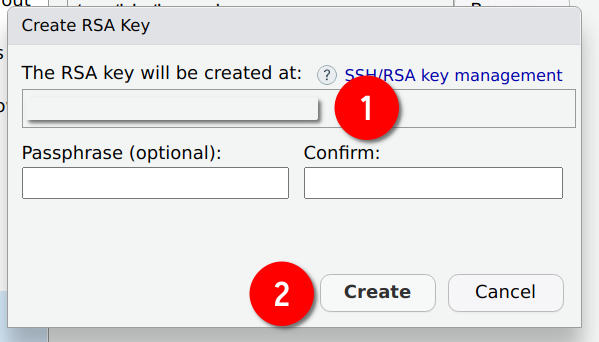
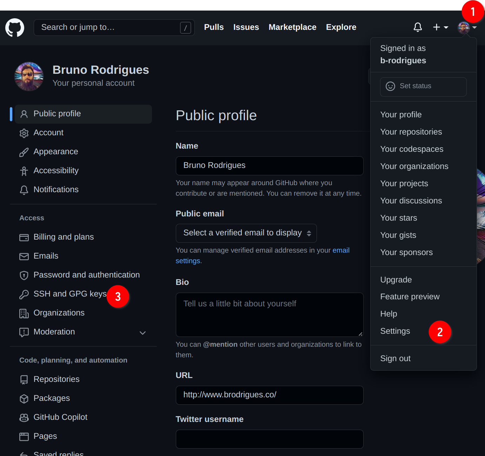
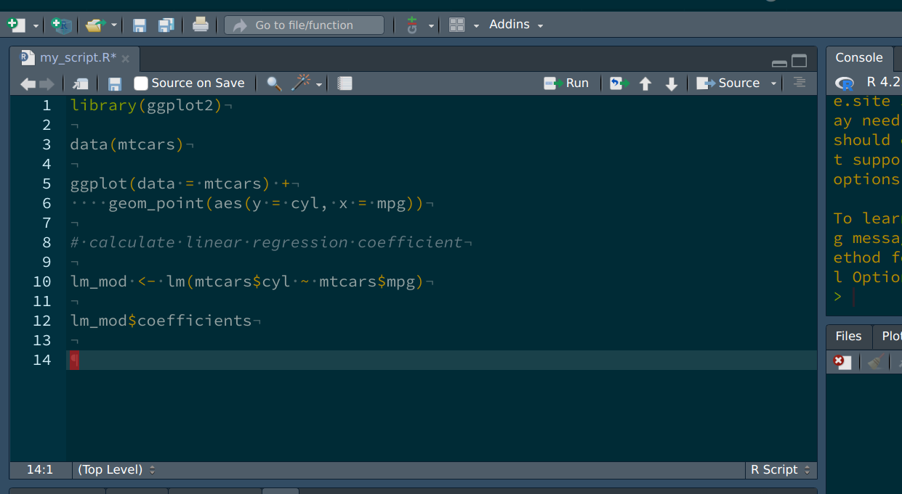

# Git

What you'll have learned by the end of the chapter: basics of working alone, and collaboration, using Git.

## Introduction

Git is a software for version control. Version control is absolutely essential in software
engineering, or when setting up a RAP. If you don’t install a version control system such as Git,
don’t even start trying to set up a RAP. But what does a version control system like Git actually
do? The basic workflow of Git is as follows: you start by setting up a repository for a project. On
your computer, this is nothing more than a folder with your scripts in it. However, if you're using
Git to keep track of what's inside that folder, there will be a hidden `.git` folder with a bunch
of files in it. You can forget about that folder, this is for Git's own internal needs. What
matters, is that when you make changes to your files, you can first *commit* these changes, and
then push them back to a repository. Collaborators can copy this repository and synchronize their
files saved on their computers with your changes. Your collaborators can then also work on the
files, then commit and push the changes to the repository as well.

You can then pull back these changes onto your computer, add more code, commit, push, etc...
Git makes it easy to collaborate on projects either with other people, or with future
you. It is possible to roll back to previous versions of your code base, you can create new 
branches of your project to test new features (without affecting the main branch of your code),
collaborators can submit patches that you can review and merge, and and and...

In my experience, learning git is one of the most difficult things there is for students. 
And this is because Git solves a complex problem, and there is no easy way to solve
a complex problem. But I would however say that Git is not unnescessarily complex. So
buckle up, because this chapter is not going to be easy. 

Git is incredibly powerful, and absolutely essential in our line of work, it is simply not p
ossible to not know at least some basics of Git. And this is what we're going to do, 
learn the basics, it'll keep us plenty busy already.

But for now, let's pause for a brief moment and watch [this video](https://www.youtube.com/watch?v=2ReR1YJrNOM)
that explains in 2 minutes the general idea of Git.

Let's get started. 

You might have heard of [github.com](https://github.com): this is a website that
allows programmers to set up repositories on which they can host their code. The way to interact
with github.com is via Git; but there are many other website like github.com, such as
[gitlab.com](https://gitlab.com) and [bitbucket.com](https://bitbucket.com).

For this course, you should create an account on [github.com](https://github.com). This should be
easy enough. Then you should install Git on your computer.

## Installing Git

Installing Git is not hard; it installs like any piece of software on your computer. If you’re
running a Linux distribution, chances are you already have Git installed. To check if it’s already
installed on a Linux system, open a terminal and type `which git`. If a path gets returned, like
`usr/bin/gin`, congratulations, it’s installed, if the command returns nothing you’ll have to
install it. On Ubuntu, type `sudo apt-get install git` and just wait a bit. If you’re using macOS
or Windows, you will need to install it manually. For Windows, download the installer from
[here](https://gitforwindows.org/), and for macOS from [here](https://git-scm.com/download/mac);
you’ll see that there are several ways of installing it on macOS, if you’ve never heard of homebrew
or macports then install the binary package from
[https://sourceforge.net/projects/git-osx-installer/](here).

## Setting up a repo

Ok so now that Git is installed, we can actually start using it. First, let's start by creating
a new repository on github.com. As I've mentioned in the introductory paragraph, Git will allow
you to interact with github.com, and you'll see in what ways soon enough. For now, login to 
your github.com account, and create a new repository by clicking on the 'plus' sign in the top
right corner of your profile page and then choose 'New repository':

```{r, echo = F}

```

In the next screen, choose a nice name for your repository and ignore the other options, they're 
not important for now. Then click on 'Create repository':

```{r, echo = F}
knitr::include_graphics("img/github_2.png")
```

Ok, we're almost done with the easy part. The next screen tells us we can start interacting with the 
repository. For this, we're first going to click on 'README': 

```{r, echo = F}
knitr::include_graphics("img/github_3.png")
```

This will add a `README` file that we can also edit from github.com directly:

```{r, echo = F}
knitr::include_graphics("img/github_4.png")
```

Add some lines to the file, and then click on 'Commit new file'. You'll end up on the main page of
your freshly created repository. We are now done with setting up the repository on github.com. We
can now *clone* the repository onto our machines. For this, click on 'Code', then 'SSH' and then 
on the copy icon:

```{r, echo = F}
knitr::include_graphics("img/github_5.png")
```

Now, to make things easier on you, we're going to use Rstudio as an interface
for Git. But you should know that Git can be used independently from a terminal
application on Linux or macOS, or from Git Bash on Windows, and you should 
definitely get familiar with the Linux/macOS command line at some point if you wish
to become a data scientist. This is because most servers, if not all, that you are
going to interact with in your career are running some flavour of Linux. But since
the Linux command line is outside the scope of this course, we'll use Rstudio instead
(well, we’ll use it as much as we can, because at some point it won’t be enough and
have to use the terminal instead anyways...).

## Cloning the repository onto your computer

Start Rstudio and click on 'new project' and then 'Version Control':

```{r, echo = F}
knitr::include_graphics("img/github_6.png")
```

Then choose 'Git':

```{r, echo = F}
knitr::include_graphics("img/github_7.png")
```

Then paste the link from before into the 'Repository URL' field, the 'project directory name' 
will fill out automatically, choose where to save the repository in your computer, click on
'Open in new session' and then on 'Create Project':

```{r, echo = F}
knitr::include_graphics("img/github_8.png")
```

A new Rstudio window should open. There are several things that you should pay attention to now:

```{r, echo = F}

```

Icon (1) indicates that this project is *git-enabled* so to speak. (2) shows you that Rstudio is open
inside the `example_repo` (or whatever you named your repo to) project, and (3) shows you the actual
repository that was downloaded from github.com at the path you chose before. You will also see the 
`README` file that we created before.

## Your first commit

Let's now create a simple script and add some lines of code to it, and save it. Check out the `Git`
tab now, you should see your script there, alongside a `?` icon:

```{r, echo = F}
knitr::include_graphics("img/github_10.png")
```

We are now ready to commit the file, but first let's check out what actually changed. If you click
on `Diff`, a new window will open with the different files that changed since last time:

```{r, echo = F}
knitr::include_graphics("img/github_11.png")
```

Icon (1) shows you the list of files that changed. We only created the file called `my_script.R`, but two
other files are listed as well. These files are automatically generated when starting a new project.
`.gitignore` lists files and folders that Git should not track, meaning, any change that will affect
these files will be ignored by Git. This means that these files will also not be uploaded to 
github.com when committing. The file ending with the `.Rproj` extension is a RStudio specific file,
which simply defines some variables that help RStudio start your project. What matters here is
that the files you changed are listed, and that you saved them. You can double check that you actually
correctly saved your files by looking at (2), which lists the lines that were added (added lines 
will be highlighted in green, deleted lines in red). In (3) you can write a commit message. This
message should be informative enough that a coworker, or future you, can read through them and have
a rough idea of what changed. Best practice is to commit often and early, and try to have one commit
per change (per file for example, or per function within that file) that you make. 
Let's write something like: "Started project: first graph done" as the commit message. We're almost done: now
let's stage the files for this commit. This means that we can choose which files should actually
be included in this commit. You can only stage one file, several files, or all files. Since this is
our first commit, let's stage everything we've got, by simply clicking on the checkboxes below the 
column `Staged` in (1).

```{r, echo = F}
knitr::include_graphics("img/github_12.png")
```

The status of the files now changed: they've been added for this commit. We can now click on the 
`Commit` button. Now these changes have been committed there are no unstaged files anymore. We have
two options at this point: we can continue working, and then do another commit, or we can push
our changes to github.com. Committing without pushing does not make our changes available to our
colleagues, but because we committed them, we can recover our changes. For example, if I continue
working on my file and remove some lines by mistake, I can recover them (I'll show you how to do
this later on). But it is a much better idea to push our commit now. This makes our changes
available to colleagues (who need to pull the changes from github.com) and should our computer
spontaneously combust, at least or work is now securely saved on github.com. So let's `Push`:

```{r, echo = F}
knitr::include_graphics("img/github_13.png")
```

Ooooooops! Something's wrong! Apparently, we do not have access rights to the repo? This can sound
weird, because after all, we created the repo with our account and then cloned it. So what's going
on? Well, remember that anyone can clone a public repository, but only authorized people can 
push changes to it. So at this stage, the Git software (that we're using through RStudio) has 
no clue who you are. Git simply doesn't know that your the *admin* of the repository. You need to
provide a way for Git to know by logging in. And the way you login is through a so-called ssh key.

Now if you thought that Git was confusing, I'm sorry to say that what's coming confuses students
in general even more. Ok so what's a ssh key, and why does Git need it? *An* ssh key is actually
a misnomer, because we should really be talking about a pair of keys. The idea is that you 
generated two files on the computer that you need to access github.com from. One of these keys
will be a public key, the other a private key. The private key will be a file usually called
`id_rsa` without any extension, while the public key will be called the same, but with a `.pub`
extension, so `id_rsa.pub` (we will generate these two files using RStudio in a bit).
What you do is that you give the public key to github.com, but you keep your private key on
your machine. Never, ever, upload or share your private key with anyone! It's called private for
a reason. Once github.com has your public key, each time you want to push to github.com, 
what happens is that the public key is checked against your private key. If they match, github.com
knows that you are the person you claim to be, and will allow you to push to the repository. If not
you will get the error from before. 

So let's now generate an ssh key pair. For this, go to `Tools > Global Options > Git/Svn`, and then
click on the `Create RSA Key...`

```{r, echo = F}
knitr::include_graphics("img/github_14.png")
```

Icon (1) shows you the path where the keys will be saved. This is only useful if
you have reasons to worry that your private key might be compromised, but without physical access
to your machine, an attacker would have a lot of trouble retrieving it (if you keep your OS updated...).
Finally click on `Create`: 

```{r, echo = F}

```

Ok so now that you have generated these keys, let's copy the public key in
our clipboard (because we need to paste the key into github.com). You should be able to find this
key from RStudio. Go back to `Tools > Global Options > Git/Svn`, and then click on `View public key`:

```{r, echo = F}
knitr::include_graphics("img/github_18.png")
```

A new window will open showing you your public key. You can now copy and paste it into github.com.
For this, first go to your profile, then `Settings` then `SSH and GPG keys`:

```{r, echo = F}

```

Then, on the new screen click on `New SSH key`:

```{r, echo = F}
knitr::include_graphics("img/github_17.png")
```

You can now add your key. Add a title, for example `home` for your home
computer, or `work` for your work laptop. Paste the key from RStudio
into the field (2), and then click on `Add SSH key`:

```{r, echo = F}
knitr::include_graphics("img/github_19.png")
```

Ok, now that github.com has your public key, you can now push your commits
without any error. Go back to RStudio, to the `Git` tab and click on 
`Push`:

```{r, echo = F}
knitr::include_graphics("img/github_20.png")
```

A new window will open, this time showing you that the upload went through:

```{r, echo = F}
knitr::include_graphics("img/github_21.png")
```

You will need to add one public key per computer you use on github.com. 
In the past, it was possible to push your commits by providing a password
each time. This was not secure enough however, so now the only way to 
to push commits is via ssh key pairs. This concept is quite important:
whatever service you use, even if your company has a private Git server
instance, you will need to provide the public key to the central server.
All of this ssh key pair business IS NOT specific to github.com, so
make sure that you understand this well, because sooner rather later, 
you will need to provide another public key, either because you work from
several computers or because the your first job will have it's own 
Git instance.

Ok so now you have an account on github.com, and know how to set up a 
repo and push code to it. This is already quite useful, because it allows
you and future you to collaborate. What I mean by this is that if in two
or three months you need to go back to some previous version of your 
code this is now possible. Let's try it out; change the file by adding
some lines to it, commit your changes and push again. Remember to use
a commit message that explain what you did. Once you're done, go back
to the `Git` tab of Rstudio, and click on the `History` button (the 
icon is a clock):

```{r, echo = F}
knitr::include_graphics("img/github_22.png")
```

As you can see from the picture above, clicking on `History` shows every commit since the beginning
of the repo. It also shows you who pushed that particular commit, and when. For now, you will only
see your name. At (1) you see the lines I've added. These are reflected, in green, in the `History`
window. If I had removed some lines, these would have been highlighted in red in the same window.
(4) shows you the only commit history. There's not much for now, but for projects that have been
ongoing for some time, this can get quite long! Finally, (5) shows many interesting details. As
before, who pushed the commit, when, the commit message (under **Subject**), and finally the
**SHA**. This is a unique sequence of characters that identifies the commit. If you select another
commit, you will notice that its SHA is different:

```{r, echo = F}

```

The SHA identifier (called a *hash*) is what we're going to use to revert to a previous state of
the code base. But because this is a bit advanced, there is no way of doing it from RStudio. You
will need to open a terminal and use Git from there. On Windows, go to the folder of your project,
right-click on some white space and select `Git Bash Here`:

```{r, echo = F}

```

A similar approach can be used for most Linux distributions (but simply open
a terminal, Git Bash is Windows only), and you can apparently do something
similar on macOS, but first need to active the required service 
as [explained here](https://ladedu.com/how-to-open-a-terminal-window-at-any-folder-from-finder-in-macos/#How-to-Open-Mac-Terminal-from-Finder-in-the-Current-Folder).
You can also simply open a terminal and navigate to the right folder using
`cd`.^[Remember the introduction to this book, where I discussed everything else that you should know...]

Once the terminal is opened, follow along but by adapting the paths to your 
computer:

```{bash}
# The first line changes the working directory to my github repo on my computer
# If you did not open the terminal inside the folder as explained above, you need
# adapt the path.

cd ~/six_to/example_repo  # example_repo is the folder where I cloned the repo
ls # List all the files in the directory
```

Listing the files inside the folder confirms that I'm in the right spot. Something
else you could do here is try out some git commands, for example, `git log`:

```{bash, eval = F}
git log
```

```
## commit bd7daf0dafb12c0a19ba65f85b54834a02f7d150
## Author: Bruno Rodrigues <bruno@brodrigues.co>
## Date:   Mon Oct 17 14:38:59 2022 +0200
## 
##     added some more lines
## 
## commit 95c26ed4dffd8fc40503f25ddc11af7de5c586c0
## Author: Bruno Rodrigues <bruno@brodrigues.co>
## Date:   Sat Oct 15 12:52:43 2022 +0200
## 
##     Started project: first graph done
## 
## commit d9cff70ff71241ed8514cb65d97e669b0bbdf0f6
## Author: Bruno Rodrigues <brodriguesco@protonmail.com>
## Date:   Thu Oct 13 22:12:06 2022 +0200
## 
##     Create README.md

```

`git log` returns the same stuff as the `History` button of the `Git` pane inside
RStudio. You see the commit hash, the name of the author and when the commit was
pushed. At this stage, we have two options. We could "go back in time", but just look
around, and then go back to where the repository stands currently. Or we could essentially go back in time, and
stay there, meaning, we actually revert the code base back. Let's try the first
option, let's just take a look around at the code base at a particular point in time.
Copy the hash of a previous commit. With the hash in your clipboard, use the `git checkout` 
command to go back to this commit:

```{bash, eval = F}
git checkout 95c26ed4dffd8f
```

You will see an output similar to this:

```
Note: switching to '95c26ed4dffd8f'.

You are in 'detached HEAD' state. You can look around, make experimental
changes and commit them, and you can discard any commits you make in this
state without impacting any branches by switching back to a branch.

If you want to create a new branch to retain commits you create, you may
do so (now or later) by using -c with the switch command. Example:

  git switch -c <new-branch-name>

Or undo this operation with:

  git switch -

Turn off this advice by setting config variable advice.detachedHead to false

HEAD is now at 95c26ed Started project: first graph done

```

When checking out a commit, you are in *detached HEAD* state. I won't go into specifics, but what
this means is that anything you do here, won't get saved, unless you specifically create a new
branch for it. A Git repository is composed of branches. The branche you’re currently working
on should be called *main* or *master*. You can create new branches, and continue working
on these other branches, without affecting the *master* branch. This allows to explore
new ideas and experiment. If this turns out to be fruitful, you can merge the experimental
branch back into *master*. We are not going to explore branches in this course, so you’ll
have to read about it on your own. But don’t worry, branches are not that difficult to grok.

Take a look at the script file now, you will see that the lines you added are now missing (the
following line only works on Linux, macOS, or inside a Git Bash terminal on Windows. `cat` is a
command line program that prints the contents of a text file to a terminal):

```{bash, eval = F}
cat my_script.R
```

Once you're done taking your tour, go back to the main (or master) branch by running:

```{bash, eval = F}
git checkout main
```

Ok, so how do we actually go back to a previous state? For this, use `git revert`.
But unlike `git checkout`, you don't use the hash of the commit you want to go back to.
Instead, you need to use the hash of the commit you want to "cancel". For example,
imagine that my commit history looks like this:

```
## commit bd7daf0dafb12c0a19ba65f85b54834a02f7d150
## Author: Bruno Rodrigues <bruno@brodrigues.co>
## Date:   Mon Oct 17 14:38:59 2022 +0200
## 
##     added some more lines
## 
## commit 95c26ed4dffd8fc40503f25ddc11af7de5c586c0
## Author: Bruno Rodrigues <bruno@brodrigues.co>
## Date:   Sat Oct 15 12:52:43 2022 +0200
## 
##     Started project: first graph done
## 
## commit d9cff70ff71241ed8514cb65d97e669b0bbdf0f6
## Author: Bruno Rodrigues <brodriguesco@protonmail.com>
## Date:   Thu Oct 13 22:12:06 2022 +0200
## 
##     Create README.md

```

and let's suppose I want to go back to commit `95c26ed4dffd8fc`
(so my second commit). What I need to do is essentially cancel
commit `bd7daf0dafb1`, which comes after commit `95c26ed4dffd8fc`
(look at the dates: commit `95c26ed4dffd8fc` was made on October 15th
and commit `bd7daf0dafb1` was made on October 17th).
So I need to revert commit `bd7daf0dafb1`. And that's what we're going
to do:

```{bash, eval = F}
git revert bd7daf0dafb1
```

This opens a text editor inside your terminal. Here you can add a commit
message or just keep the one that was added by default. Let's just keep
it and quit the text editor. Unfortunately, this is not very use friendly,
but to quit the editor type `:q`.
(The editor that was opened is vim, a very powerful terminal editor, but
with a very steep learning curve.)
Now you're back inside your terminal. Type `git log` and you will see a new 
commit (that you have yet to push), which essentially cancels the commit 
`bd7daf0dafb1`. You can now push this; for pushing this one, let's stay 
inside the terminal and use the following command:

```{bash, eval = F}
git push origin main
```

`origin main`: `origin` here refers to the remote repository, so to github.com,
and `main` to the main branch.

Ok, we're doing with the basics. Let's now see how we can contribute to some
repository.
 
## Collaborating 

Github (and similar services) allow you to collaborate with people. There are
two ways of achieving this. You can invite people to work with you on the same
project, by giving them writing rights to the repository. This is what we are
going to cover in this section. The other way to collaborate is to let strangers
fork your repository (make a copy of it on github.com); they can then work on
their copy of the project independently from you. If they want to submit patches 
to you, they can do so by doing a so-called *pull request*. This workflow is quite
different from what we'll see here and will be discussed in the next section.

So for this section you will need to form teams of at least 2 people. One of you will
invite the other to collaborate by going on github.com and then following the instructions
in the picture below:

```{r, echo = F}
knitr::include_graphics("img/github_25.png")
```

Type the username of your colleague to find him/her. In my case I'm inviting my 
good friend David Solito:

```{r, echo = F}
knitr::include_graphics("img/github_26.png")
```

David now essentially owns the repository as well! So he can contribute to it, just like me.
Now, let's suppose that I continue working on my end, and don't coordinate with David.
After all, this is a post-covid world, so David might be working asynchronously from home,
and maybe he lives in an entire different time zone completely! What's important to realize, is that
unlike other ways of collaborating online (for example with an office suite), you do not
need to coordinate to collaborate with Git. 

The file should look like this (yours might be different, it doesn't matter):

```{r, eval = F}
data(mtcars)

plot(mtcars$mpg, mtcars$hp)
```

I'm going to change it to this:

```{r}
library(ggplot2)

data(mtcars)

ggplot(data = mtcars) +
  geom_point(aes(y = hp, x = mpg))

```

The only thing I did was change from the base plotting functions to `{ggplot2}`. 
Since you guys formed groups, please work independently on the repository. Go crazy, change
some lines, add lines, remove lines, or add new files with new things. Just work as normal,
and commit and push your changes and see what happens.

So let's commit and push. You can do it from RStudio or from the command line/Git Bash.
This is what I'll be doing from now on, but feel free to continue using Git through RStudio:

```{bash, eval = F}
git add . # This adds every file I've changed to this next commit
git commit -am "Remade plot with ggplot2" # git commit is the command to create the commit. The -am flag means: 'a' stands for all, as in 'adding all files to the commit', so it's actually redundant with the previous line, but I use it out of habit, and 'm' specifies that we want to add a message
git push origin main # This pushes the commit to the repository on github.com

```

And this is what happens:

```
➤ git push origin main

   To github.com:b-rodrigues/example_repo.git
    ! [rejected]        main -> main (fetch first)
   error: failed to push some refs to 'github.com:b-rodrigues/example_repo.git'
   hint: Updates were rejected because the remote contains work that you do
   hint: not have locally. This is usually caused by another repository pushing
   hint: to the same ref. You may want to first integrate the remote changes
   hint: (e.g., 'git pull ...') before pushing again.
   hint: See the 'Note about fast-forwards' in 'git push --help' for details.
```

What this all means is that David already pushed some changes while I was working on the 
project as well. It says so very cleary *Updates were rejected because the remote contains
work that you do not have locally.*
Git tells us that we first need to pull (download, if you will) the changes to our own computer 
to integrate the changes, and then we can push again.

At this point, if we want, we can first go to github.com and see the commit history there to
see what David did. Go to your repo, and click on the commit history icon:

```{r, echo = F}

```

Doing so will list the commit history, as currently on github.com:

```{r, echo = F}
knitr::include_graphics("img/github_28.png")
```

While I was working, David pushed 2 commits to the repository. If you compare to your local history,
using `git log` you will see that these commits are not there, but instead, however many
commits you did (this will not be the case for all of you; whoever of you pushed first will not
see any difference between the local and remote repository). Let's see how it looks for me:

```{bash, eval = F}
git log

```

```
commit d2ab909fc679a5661fc3c49c7ac549a2764c539e (HEAD -> main)
Author: Bruno Rodrigues <bruno@brodrigues.co>
Date:   Tue Oct 18 09:28:10 2022 +0200

    Remade plot with ggplot2

commit e66c68cc8b58831004d1c9433b2223503d718e1c (origin/main, origin/HEAD)
Author: Bruno Rodrigues <bruno@brodrigues.co>
Date:   Mon Oct 17 17:33:33 2022 +0200

    Revert "added some more lines"
    
    This reverts commit bd7daf0dafb12c0a19ba65f85b54834a02f7d150.

commit bd7daf0dafb12c0a19ba65f85b54834a02f7d150
Author: Bruno Rodrigues <bruno@brodrigues.co>
Date:   Mon Oct 17 14:38:59 2022 +0200

    added some more lines

commit 95c26ed4dffd8fc40503f25ddc11af7de5c586c0
Author: Bruno Rodrigues <bruno@brodrigues.co>
Date:   Sat Oct 15 12:52:43 2022 +0200

    Started project: first graph done

commit d9cff70ff71241ed8514cb65d97e669b0bbdf0f6
Author: Bruno Rodrigues <brodriguesco@protonmail.com>
Date:   Thu Oct 13 22:12:06 2022 +0200

    Create README.md


```

Yep, so none of David's commits in sight. Let me do what Git told me to do: let's pull,
or download, David's commits locally:

```{bash, eval = F}
git pull --rebase 
```

`--rebase` is a flag that keeps the commit history linear. There are many different ways
you can pull changes, but for our purposes we can focus on `--rebase`. The other strategies
are more advanced, and you might want at some point to take a look at them.

Once `git pull --rebase` is done, we get the following message:

```
Auto-merging my_script.R
CONFLICT (content): Merge conflict in my_script.R
error: could not apply d2ab909... Remade plot with ggplot2
hint: Resolve all conflicts manually, mark them as resolved with
hint: "git add/rm <conflicted_files>", then run "git rebase --continue".
hint: You can instead skip this commit: run "git rebase --skip".
hint: To abort and get back to the state before "git rebase", run "git rebase --abort".
Could not apply d2ab909... Remade plot with ggplot2

```

Once again, it is important to read what Git is telling us. There is a merge conflict
in the `my_script.R` file. Let's open it, and see what's going on:

```{r, echo = F}

```

We can see two things: the lines that David changed in (1), and the lines I've added
in (2). This happened because we changed the same lines. Had I added lines instead of
changing lines that were already there, the merge would have happened automatically,
because there would not have been any conflict. In this case however, Git does not know
how to solve the issue: do we keep David's changes, or mine? Actually, we need to keep both.
I'll keep my version of plot that uses `{ggplot2}`, but will also keep what David added:
he replaced the `hp` variable by `cyl`, and added a linear regression as well. Since this
seems sensible to me, I will adapt the script in a way that gracefully merges both
contributions. So the file looks like this now:

```{r, echo = F}

```

We can now save, and continue following the hints from Git, namely, adding the changed 
file to the next commit and then use `git rebase --continue`:

```{bash, eval = F}
git add my_script.R
git rebase --continue
```

This will once again open the editor in your terminal. Simply close it with `:q`. Let's now push:

```{bash, eval = F}
git push origin main
```

and we're done! Let's go back to github.com to see the commit history. You can click on the
hash to see the details of how the file changed (you can do so from RStudio as well):

```{r, echo = F}

```

In green, you see lines that were added, and in red, lines that were removed. The lines
where the linear model was defined are not impacted, because David wrote them at the bottom
of the script, and I did not write anything there:

```{r, echo = F}
knitr::include_graphics("img/github_32.png")
```

Ok, so this wraps up this chapter. Git is incredibly feature rich and complex, but as 
already discussed, it is NOT optional to know about Git in our trade. So now that you
have some understanding of how it works, I suggest that you read the manual
[here](https://git-scm.com/book/tr/v2/Git-Basics-Getting-a-Git-Repository). 

## Contributing to someone else's repository

It is also possible to contribute to someone else's repository; by this I mean
someone who is not a colleague, and who did not invite you to his or her repository.
So this means that you do not have writing rights to the repository and cannot 
push to it.

This is outside the scope of this course, but it is crucial that you understand
this as well. For this reason, I highly recommend reading this 
[link](https://opensource.com/article/19/7/create-pull-request-github).
