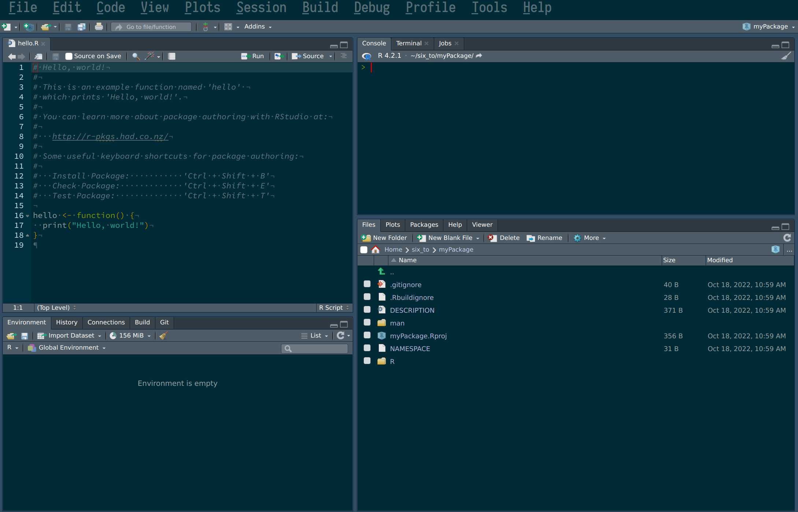
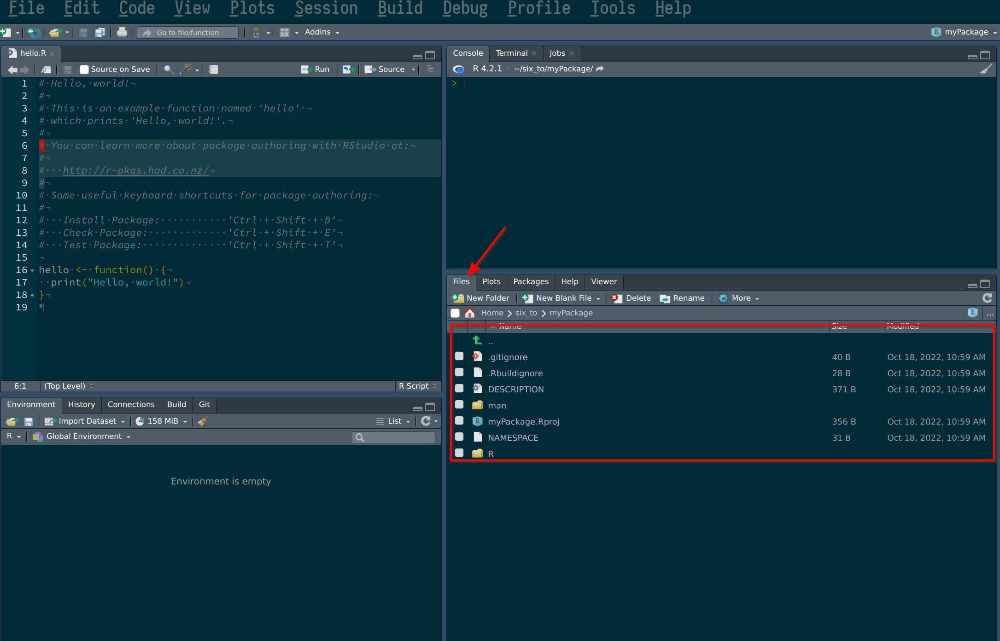
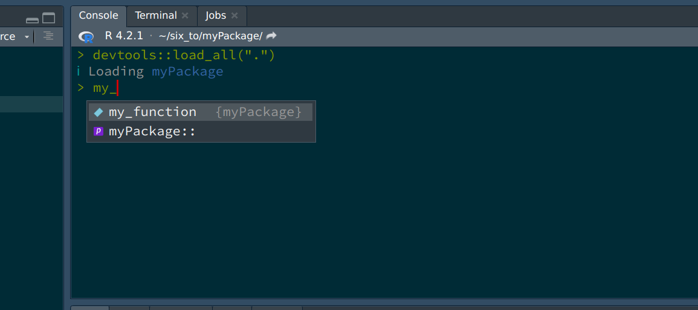
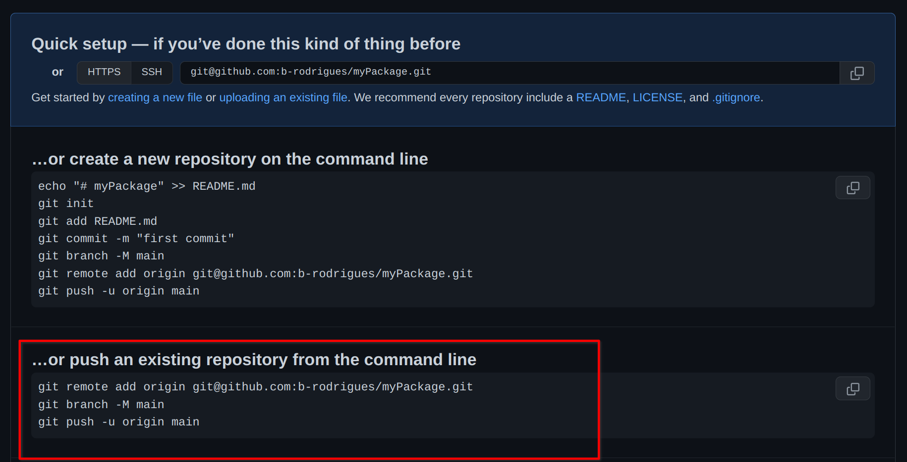
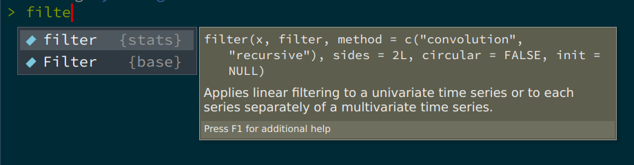
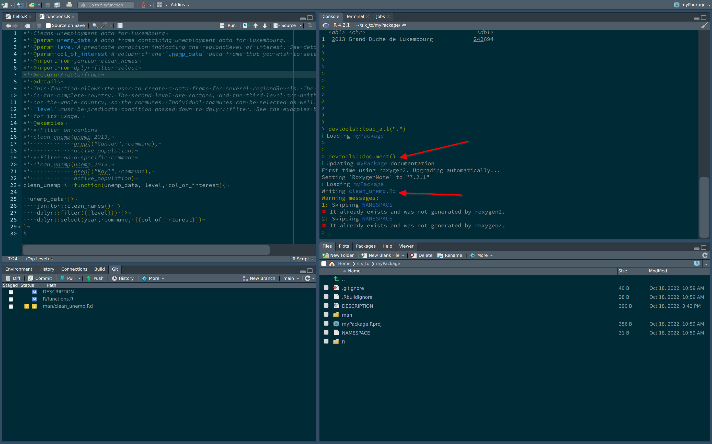

# Package development

<div style="text-align:center;">
```{r, echo = F}

```
</div>

What you’ll have learned by the end of the chapter: building and documenting your own package.

## Introduction

In this chapter we're going to develop our own package. This package will contain
some functions that we will write to analyze some data.
Don't focus too much on what these functions do or don't do, that's not really important.
What matters is that you understand how to build your own package, and why that's useful.

R, as you know, has many many packages. When you type something like 

```{r, eval = F}
install.packages("dplyr")
```

This installs the `{dplyr}` package. The package gets downloaded from a repository called 
CRAN - The Comprehensive R Archive Network (or from one of its mirrors). Developers thus
work on their packages and once they feel the package is ready for production they submit
it to CRAN. There are very strict rules to respect to publish on CRAN; but if the developers
respects these rules, and the package does something *non-trivial* (non-trivial is not really defined
but the idea is that your package cannot simply be a collection of your own implementation
of common mathematical functions for example), it'll get published. 

CRAN is actually quite a miracle; it works really well, and it's been working well for decades, 
since CRAN was founded in [1997](https://stat.ethz.ch/pipermail/r-announce/1997/000001.html).
Installing packages on R is rarely frustrating, and when it is, it is rarely, if ever,
CRAN's fault (there are some packages that require your operating system to have certain
libraries or programs installed beforehand, and these can be frustrating to install, like `java`
or certain libraries used for geospatial statistics).

But while from the point of view from the user, CRAN is great, there are sometimes some
frictions between package developers and CRAN maintainers. I'll spare you the drama, but just
know that contributing to CRAN can be sometimes frustrating.

This does not concern us however, because we are going to learn how to develop a package but
we are not going to publish it on CRAN. Instead, we will be using github.com as a replacement
for CRAN. This has the advantage that we do not have to be so strict and disciplined when 
writing our package, and other users can install the package almost just as easily from
github.com, with the following command:

```{r, eval = F}
remotes::install_github("github_username/some_package")
```

It is also possible to build the package and send it as a file per email for example, and then
install a local copy. This is more cumbersome, that's why we're going to use github.com as a
repository.

## Getting started

Let's first start by opening RStudio, and start a new project:

<div style="text-align:center;">
<video width="640" height="480" controls>
  <source src="img/new_package.mp4" type="video/mp4">
</video>
</div>

Following these steps creates a folder in the specified path that already contains
some scaffolding for our package. This also opens a new RStudio session with the
default script `hello.R` opened:

<div style="text-align:center;">
```{r, echo = F}

```
</div>

We can remove this script, but do take note of the following sentence:

```
# You can learn more about package authoring with RStudio at:
#
#   http://r-pkgs.had.co.nz/
#
```

If this course succeeded in turning you into an avid R programmer, you might want to contribute
to the language by submitting some nice packages one day. You could at that point refer to this link
to learn the many, many subtleties of package development. But for our purposes, this chapter
will suffice. 

Ok, so now let's take a look inside the folder you just created and take a look at the package's 
structure. You can do so easily from within RStudio:

<div style="text-align:center;">
```{r, echo = F}

```
</div>

But you can also navigate to the folder from inside a file explorer. The folder that will 
matter to us the most for now is the `R` folder. This folder will contain your scripts, which
will contain your package's functions. Let's start by adding a new script.

## Adding functions

To add a new script, simply create a new script, and while we're at it, let's add some code to it:

<div style="text-align:center;">
<video width="640" height="480" controls>
  <source src="img/pack_adding_script.mp4" type="video/mp4">
</video>
</div>

and that's it! Well, this example is incredibly easy; there will be more subtleties later on,
but these are the basics: simply write your script as usual. Now let's load the package with 
`CTRL-SHIFT-L`. Loading the package makes it available in your current R session:

<div style="text-align:center;">
```{r, echo = F}

```
</div>

As you can see, the package is loaded, and RStudio's autocomplete even suggest the function's name
already. So now that we have already a function, let's push our code to github.com (you remember that
we checked the box `Create a git repository` when we started the project?). For this, 
let's go back to github.com and create a new repository. Give it the same name as your package 
on your computer, just to avoid confusion. Once the repo is created, you will see this familiar
screen:

<div style="text-align:center;">
```{r, echo = F}

```
</div>

We will start from an existing repository, because our repository already exists. So we can 
use the terminal to enter the commands suggested here. We can also use the terminal
from RStudio:

<div style="text-align:center;">
<video width="640" height="480" controls>
  <source src="img/adding_remote.mp4" type="video/mp4">
</video>
</div>


The steps above are a way to link your local repository to the remote repository living
on github.com. Without these initial steps, there is no way to link your package project
to github.com!

Let's now write another function, which will depend on functions from other packages.

### Functions dependencies

In the same script, add the following code:

```{r, eval = F}
only_automatics <- function(dataset){
  dataset |>
    filter(am == 1)
}

```

This creates a function that takes a dataset as an argument, and filters the `am` variable.
This function is not great: it is not documented, so the user might not know that the dataset
that is meant here is the `mtcars` dataset (which is included with R by default). So we will
need to document this. Also, the variable `am` is hardcoded, that's not good either. What if 
the user wants to filter another variable with another value? We will solve these issues later
on. But there is a worse problem here. The `filter()` function that the developer intended to
use here is `dplyr::filter()`, so the one from the `{dplyr}` package. However, there are several
functions called `filter()`. If you start typing `filter` inside a fresh R session, this is 
what autocomplete suggests:

<div style="text-align:center;">
```{r, echo = F}

```
</div>

So there's a `filter()` function from the `{stats}` package (which gets loaded automatically 
with every new R session), and there's a capital F `Filter()` function from the `{base}` 
package (R is case sensitive, so `filter()` and `Filter()` are different functions).
So how can the developer specify the correct `filter()` function? Simply by using the following
notation: `dplyr::filter()` (which we have already encountered). So let's rewrite the function 
correctly:

```{r, eval = F}
only_automatics <- function(dataset){
  dataset |>
    dplyr::filter(am == 1)
}

```

Great, so now `only_automatics()` at least knows which `filter ` function to use, but this function
could be improved a lot more. In general, what you want is to have a function that is general enough
that it could work with any variable (if the dataset is supposed to be fixed), or that could work
with any combination of dataset and variable. Let's make our function a bit more general,
by making it work on any variable from any dataset:

```{r, eval = F}
my_filter <- function(dataset, condition){
  dataset |>
    dplyr::filter(condition)
}

```

I renamed the function to `my_filter()` because now this function can work on any dataset and
with any predicate condition (of course this function is not really useful, since it's only a 
wrapper around `filter()`. But that's not important). Let's save the script and reload the
package with `CRTL-SHIFT-L` and try out the function:

```{r, eval = F}
my_filter(mtcars, am == 1)

```

You will get this output:

```
Error in `dplyr::filter()` at myPackage/R/functions.R:6:4:
! Problem while computing `..1 = condition`.
Caused by error in `mask$eval_all_filter()`:
! object 'am' not found
Run `rlang::last_error()` to see where the error occurred.
```

so what's going on? R complains that it cannot find `am`.
What is wrong with our function? After all, if I call the following, it works:

```{r}
mtcars |>
  filter(am == 1)
```

So what gives? What's going on here, is that R doesn't know that it has look
for `am` inside the `mtcars` dataset. R is looking for a variable called `am`
in the global environment, which does not exist. `dplyr::filter()` is programmed
in a way that tells R to look for `am` inside `mtcars` and not in the global
environment (or whatever parent environment the function gets called from).
We need to program our function in the same way. Remember in chapter 3, where
we learned about functions that take columns of data frames as arguments? This
is exactly the same situtation here. So, let’s simply enclose 
references to columns of data frames inside `{{}}`, like so:

```{r}
my_filter <- function(dataset, condition){
  dataset |>
    dplyr::filter({{condition}})
}

```

Now, R knows where to look. So reload the package with `CTRL-SHIFT-L` and 
try again:

```{r}
my_filter(mtcars, am == 1)
```

And it’s working!

`{{}}` is not a feature available in a base installation of R, but is provided
by packages from the `tidyverse` (like `{dplyr}`, `{tidyr}`, etc). If you write functions
that depend on `{dplyr}` functions like `filter()`, `select()` etc, you'll have to know to keep using `{{}}`.

Let's now write a more useful function. Remember the datasets about unemployment in Luxembourg?
I'm thinking about the ones [here](https://rap4mads.eu/introduction-to-r.html#reading-in-data-with-r),
`unemp_2013.csv`, `unemp_2014.csv`, etc.

Let's write a function that does some basic transformations on these files:

```{r}
clean_unemp <- function(unemp_data, level, col_of_interest){

  unemp_data |>
    janitor::clean_names() |>
    dplyr::filter({{level}}) |>
    dplyr::select(year, commune, {{col_of_interest}})
}
```

This function does 3 things:

- using `janitor::clean_names()`, it cleans the column names;
- it filters on a user supplied level. This is because the csv file contains three "regional" levels so to speak: the whole country: first row, where commune equals `Grand-Duché de Luxembourg`, canton level: where commune contains the string `Canton` and the last level: the actual communes. Welcome to the real world, where data is dirty and does not always make sense.
- it selects the columns that interest us (with year and commune hardcoded, because we always want those)

So save the script, and reload your package using `CTRL-SHIFT-L`, and try with the following lines:

```{r}
unemp_2013 <- readr::read_csv("https://raw.githubusercontent.com/b-rodrigues/modern_R/master/datasets/unemployment/unemp_2013.csv")


clean_unemp(unemp_2013,
            grepl("Grand-D.*", commune),
            active_population)

```

This selects the columns for the whole country. Let's try for cantons:

```{r}
clean_unemp(unemp_2013,
            grepl("Canton", commune),
            active_population)
```

And to select for communes, we need to not select cantons nor the whole country:

```{r}
clean_unemp(unemp_2013,
            !grepl("(Canton|Grand-D.*)", commune),
            active_population)
```

This seems to be working well (in one of the next sections we will learn how to systematize these
tests, instead of running them by hand each time we change the function).
Before continuing, let's commit and push our changes.

## Documentation

It is time to start documenting our functions, and then our package. Documentation in R is not just
about telling users how to use the package and its functions, but it also serves a functional
role. There are several files that must be edited to completely document a package, and these
files also help define the dependencies of the package. Let's start with the simplest thing we can
do, which is documenting functions.

### Documenting functions

As you'll know, comments in R start with `#`. Documenting functions consists in commenting
them with a special kind of comments that start with `#'`. Let's try on our `clean_unemp()`
function:

```{r, eval = F}
#' Easily filter unemployment data for Luxembourg
#' @param unemp_data A data frame containing unemployment data for Luxembourg.
#' @param level A predicate condition indicating the regional level of interest. See details for more.
#' @param col_of_interest A column of the `unemp_data` data frame that you wish to select.
#' @importFrom janitor clean_names
#' @importFrom dplyr filter select
#' @export
#' @return A data frame
#' @details
#' This function allows the user to create a data frame for several regional levels. The first level
#' is the complete country. The second level are cantons, and the third level are neither cantons
#' nor the whole country, so the communes. Individual communes can be selected as well.
#' `level` must be predicate condition passed down to dplyr::filter. See the examples below
#' for its usage.
#' @examples
#' # Filter on cantons
#' clean_unemp(unemp_2013,
#'             grepl("Canton", commune),
#'             active_population)
#' # Filter on a specific commune
#' clean_unemp(unemp_2013,
#'             grepl("Kayl", commune),
#'             active_population)
clean_unemp <- function(unemp_data, level, col_of_interest){

  unemp_data |>
    janitor::clean_names() |>
    dplyr::filter({{level}}) |>
    dplyr::select(year, commune, {{col_of_interest}})
}

```

The special comments that start with `#'` will be compiled into a nice looking document that users
can then read. You can add sections to the documentation by using keywords that start
with `@`. The example above shows essentially everything you need to know to 
properly document your functions. An important keyword, that will not appear in the documentation
itself, is `@importFrom`. This will be useful later, when we document the package, as it helps
define the dependencies of your package. For now, let's simply remember to write this. The other
thing that might not be obvious is the `@export` line. This simply tells R that this function should be
public, available to the users. If you need to define private functions, you can omit this 
keyword and the function won't be visible to users (this is only partially true however, users
can always reach deep into the package and use private functions by using `:::`, as in `package:::my_private_function()`).

You can now save the script and press `CRTL-SHIFT-D`. This will generate the help file for your function:

<div style="text-align:center;">
```{r, echo = F}

```
</div>

Now, writing `?clean_unemp` in the console shows the documentation for `clean_unemp`:

<div style="text-align:center;">
<video width="640" height="480" controls>
  <source src="img/help_clean_unemp.mp4" type="video/mp4">
</video>
</div>

Now, let's document the package.

### Documenting the package

#### The NAMESPACE file

There are several files you need to edit to properly document your package. Some are optional
like *vignettes*, and some are not optional, like the DESCRIPTION and the NAMESPACE. Let's start
with the NAMESPACE. This file gets generated automatically, but sometimes it can happen that it
gets stuck in a state where it doesn't get generated anymore. In these cases, you should simply
delete it, and then document your package again:

<div style="text-align:center;">
<video width="640" height="480" controls>
  <source src="img/namespace.mp4" type="video/mp4">
</video>
</div>

As you can see from the video, the NAMESPACE defines some interesting stuff. First, it says which
of our functions are exported, and should be available to the users. Then, it defines the imports.
This is possible because of the `@importFrom` keywords from before. What we can now do, is go 
back to our function and remove all the references to the packages and simply use the functions,
meaning that we can use `filter(blabla)` instead of `dplyr::filter()`. But in my opinion, it is
best to keep them the script as it is. There already there, and by having them there, even if they’re
redundant with the NAMESPACE, someone reading the source code will know immediately where the functions come from.
But if you want, you can remove the references to the packages, it'll work.

#### The DESCRIPTION file

The DESCRIPTION file requires more manual work. Let's take a look at the file as it stands:

```
Package: myPackage
Type: Package
Title: What the Package Does (Title Case)
Version: 0.1.0
Author: Who wrote it
Maintainer: The package maintainer <yourself@somewhere.net>
Description: More about what it does (maybe more than one line)
    Use four spaces when indenting paragraphs within the Description.
License: What license is it under?
Encoding: UTF-8
LazyData: true
RoxygenNote: 7.2.1
```

Let's change this to:

```
Package: myPackage
Type: Package
Title: Clean Lux Unemployment Data
Version: 0.1.0
Author: Bruno Rodrigues
Maintainer: Bruno Rodrigues
Description: This package allows users to easily get unemployent data for Luxembourg
    from raw csv files
License: GPL (>=3)
Encoding: UTF-8
LazyData: true
RoxygenNote: 7.2.1
```

All of this is not really important if you're not releasing your package on CRAN, but still important
to think about. If it's a package you're keeping private to your company, none of it matters
much, but if it's on github.com, you might want to still fill out these fields. What could be important
is the license you're releasing the package under (again, only important if you release on CRAN or 
keep it on github.com). What’s really important in this file, is what’s missing. We are going to add some more lines
to this file, which are quite important:

```
Package: myPackage
Type: Package
Title: Clean Lux Unemployment Data
Version: 0.1.0
Author: Bruno Rodrigues
Maintainer: Bruno Rodrigues
Description: This package allows users to easily get unemployent data for Luxembourg
    from raw csv files
License: GPL (>=3)
Encoding: UTF-8
LazyData: true
RoxygenNote: 7.2.1
RemoteType: github
Depends:
    R (>= 4.1),
Imports:
    dplyr,
    janitor
Suggests: 
    knitr,
    rmarkdown,
    testthat
```

We added three fields:

- RemoteType: we need to specify here that this package lives on github.com. This will become important for reproducibility purposes.
- Depends: we can define hard dependencies here. Because I'm using the base pipe `|>` in my examples, my package needs at least R version 4.1.
- Imports: these is where we list packages that our package needs in order to run. If these packages are not available, they will be installed when users install our package.
- Suggests: these packages are not required to run, but can unlock further capabilities. This is also where we can list packages that are required to build *vignettes* (which we'll discover shortly), or for unit testing.

There is another field we could add, Remotes, which is where we could define the usage of a package
only released on github.com. To know more about this, read 
[this section](https://r-pkgs.org/dependencies.html#nonstandard-dependencies)
of [R packages](https://r-pkgs.org/).

#### Vignettes

Vignettes are long form documentation that explain some of the use-cases of your package.
They are written in the RMarkdown format, which we will learn about in chapter 8.
To see an example of a vignette, you can take a look at this vignette titled
[A non-mathematician's introduction to monads](https://b-rodrigues.github.io/chronicler/articles/advanced-topics.html)
from my `{chronicler}` package, or you could also type:

```{r}
vignette(package = "dplyr")
```

to see the list of available vignettes for the `{dplyr}` package, and then write:

```{r, eval = F}
vignette("programming", "dplyr")
```

to open the vignette locally.

#### Package's website

In the previous section I've linked to a vignette from my `{chronicler}` package. 
[The website](https://b-rodrigues.github.io/chronicler/) was automatically generated
using the [pkgdown](https://pkgdown.r-lib.org/) package. We are not going to discuss how
it works in detail here, but you should know this exists, and is actually quite easy to use.

### Checking your package

Before sharing your package with the world, you might want to run `devtools::check()` to make sure
everything is alright. `devtools::check()` will make sure that you didn't forget something crucial,
like declaring a dependency in the DESCRIPTION file for example. The goal is to see something
like this at the end of `devtools::check()`:

```
0 errors ✔ | 0 warnings ✔ | 3 notes ✖
```

If you want to release your package on CRAN, it's a good idea to address the notes as well, but 
what you must absolutely deal with are errors and warnings, even if you're keeping this package
for yourself.

### Installing your package

Once you're done working on your package, you can install it with `CRTL-SHIFT-B`. This way
you can start using your package from any R session. People that want to install your package
can use `devtools::install_github()` to install it from github.com. You might want to communicate 
a specific commit hash to your users, so they install a fixed version of your package, and not
the latest development version. For example, let’s suppose that I have been working on my package,
but would prefer my potential users to install the package as it stood at the commit with the
hash `"e9d9129de3047c1ecce26d09dff429ec078d4dae"`. I can write this in the README of the package:

```
To install the package, please use the following line

devtools::install_github("b-rodrigues/myPackage", ref = "e9d9129de3047c1ecce26d09dff429ec078d4dae")
```

This will install the `{myPackage}` package as it looked like at this particular commit. You could
also create a branch called `release` for example, and direct users to install from this branch:

```
To install the package, please use the following line

devtools::install_github("b-rodrigues/myPackage", ref = "release")
```

But for this, you need to create a release branch, which will only contain release-ready code.

## Further reading

- https://r-pkgs.org/
