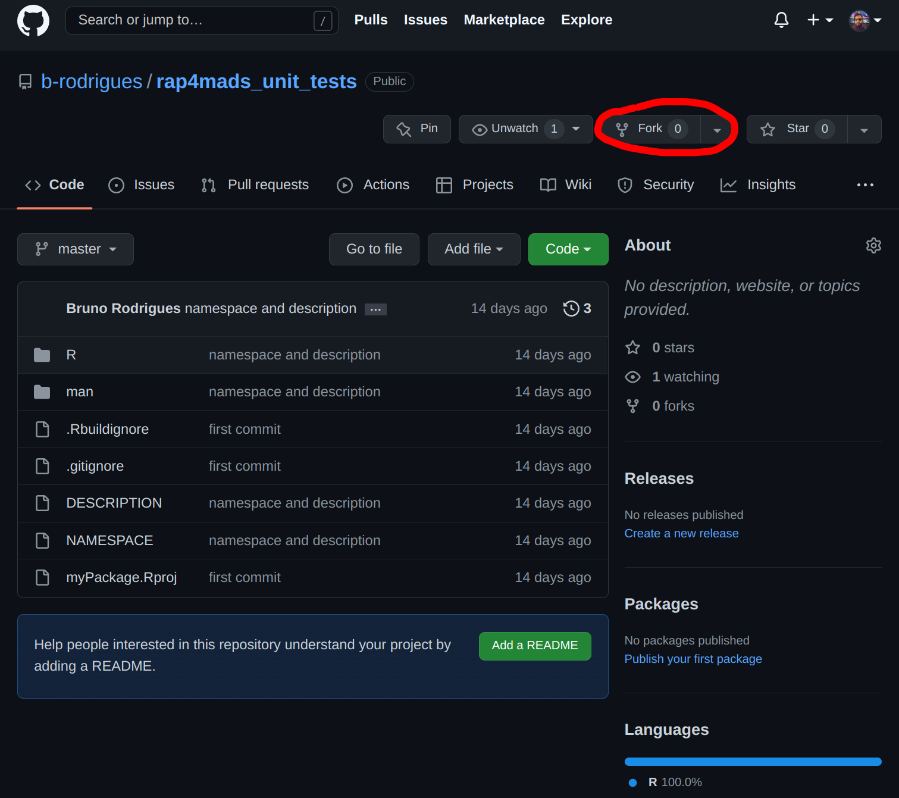

# Unit tests

<div style="text-align:center;">
```{r, echo = F}
knitr::include_graphics("img/pcr_test.png")
```
</div>

What you’ll have learned by the end of the chapter: what unit tests are, how to write them, and how
to test your package thoroughly.

## Introduction

It might not have seemed like it, but developing our own package was actually the first step in
writing reproducible code. Packaged code is easy to share, and much easier to run than code that
lives inside scripts. When you share code, be it with future you or others, you have a
responsibility to ship high quality code. Unit tests are one way to ensure that your code works as
intented, but it is not a panacea. But if you write short, well-documented functions, and you
package them, and test them thoroughly, you are on the right track for success.

But what are unit tests? Unit tests are pieces of code that test other pieces of code (called units
in this context). It turns out that functions are units of code, and that makes testing them quite
easy. I hope that you are starting to see the pieces coming all together: I introduced you to
functional programming and insisted that you write your code as a sequence of functions calls,
because it makes it easier to package and document everything. And now that your code lives inside
a package, as a series of functions, it will be very easy to test these functions (or units of
code).

## Testing your package

To make sure that each one of us starts with the exact same package and code, you will first of all
fork the following repository [that you can find here](https://github.com/b-rodrigues/unemp_lux_r4m).


```{r, echo = F}

```

Forking the repository will add a copy of the repository to your github account. You can now clone your fork
of the repo (make sure you clone using the ssh link!) and start working!

Because our code is packaged, starting to write unit tests will be very easy. For this, open RStudio
and make sure your package’s project is opened:

```{r, echo = F}
knitr::include_graphics("img/pack_7.png")
```

In order to set up the required files and folders for unit testing, run the following line in the R
console:

```{r, eval = F}
usethis::use_test("clean_unemp")
```

You should see a folder called `tests` appear inside the package. Inside `tests`, there is another
folder called `testthat`, and inside this folder you should find a file called
`test-clean_unemp.R`. This file should contain an example:

```{r, eval = F}
test_that("multiplication works", {
  expect_equal(2 * 2, 4)
})

```

This is quite self-explanatory; `test_that()` is the function that we are going to use to write
tests. It takes a string as an argument, and a test. For the string write an explanatory name. This
will make it easier to find the test if it fails. `expect_equal()` is a function that tests the
equality between its arguments. On one side we have `2 * 2`, and on the other, `4`. All our tests
will look somewhat like this. There are many `expect_` functions, that allow you to test for many
conditions. You can take a look at `{testthat}`’s [function
reference](https://testthat.r-lib.org/reference/index.html) for a complete list.

So, what should we test? Well, here are several ideas:

- Is the function returning an expected value for a given input?
- Can the function deal with all kinds of input? What happens if an unexpected input is provided?
- Is the function failing as expected for certain inputs?
- Is the function dealing with corner cases as intended?

Let’s try to write some tests for our `clean_unemp()` function now, and start to consider each of these questions.

### Is the function returning an expected value for a given input?

Let’s start by testing if our function actually returns data for the Grand-Duchy of Luxembourg if
the user provides a correct regular expression. Add these lines to the script (and remove the 
example test while you're at it):

```{r, eval = F}

unemp_2013 <- readr::read_csv("https://raw.githubusercontent.com/b-rodrigues/modern_R/master/datasets/unemployment/unemp_2013.csv")

test_that("selecting the grand duchy works", {

  returned_value <- clean_unemp(
                      unemp_2013,
                      grepl("Grand-D.*", commune),
                      active_population)

expected_value <- tibble::as_tibble(
list("year" = 2013, 
"commune" = "Grand-Duche de Luxembourg", 
"active_population" = 242694))

  expect_equal(returned_value, expected_value)
})

```

So what’s going on here? First, I need to get the data. I load the data outside of the test, so
it’ll be available to every test afterwards as well. Then, inside the test, I need to define two
more variables: the actual value returned by the function, and the value that we expect. I need to
create this value by hand, and I do so using the `tibble::as_tibble()` function. This function
takes a list as an argument and converts it to a tibble. I did not explain what tibbles are yet:
tibbles are basically the same as a data frame, but have a nicer print method, and other niceties.
In practice, you don’t need to think about tibbles too much, but here you need to be careful:
`clean_unemp()` returns a tibble, because that’s what `{dplyr}` functions return by default. So if
in your test you compare a tibble to a data.frame, your test will fail, because their classes are
not equal. So I need to define my expected value as a tibble for the test to pass.

You can now save the script, and press `CTRL-SHIFT-T` to run the test. The test should pass, if
not, there’s either something wrong with your function, with the inputs you provided to it, or with
the expected value. You can keep adding tests to this script, to cover every possible use case:

```{r, eval = F}
test_that("selecting cantons works", {

  returned_value <- clean_unemp(
                      unemp_2013,
                      grepl("Canton", commune),
                      active_population)

expected_value <- readr::read_csv("test_data_cantons.csv")

  expect_equal(returned_value, expected_value)
})

```

In the test above, I cannot write the expected value by hand. So what I did instead was run my
function in a terminal, and save the output in a csv file. I used the following code for this:

```{r, eval = F}
clean_unemp(unemp_2013,
            grepl("Canton", commune),
            active_population) %>%
  readr::write_csv("tests/testthat/test_data_cantons.csv")
```

I inspected this output to make sure everything was correct. I can now keep this csv file and test
my function against it. Should my function fail when tested against it, I know that something is
wrong. We can do the same for communes. First, save the "ground truth" in a csv file:

```{r, eval = F}
clean_unemp(unemp_2013,
            !grepl("(Canton|Grand-D.*)", commune),
            active_population) %>%
  readr::write_csv("tests/testthat/test_data_communes.csv")

```

Then, we can use this csv file in our tests:

```{r, eval = F}
test_that("selecting communes works", {

  returned_value <- clean_unemp(
                      unemp_2013,
                      !grepl("(Canton|Grand-D.*)", commune),
                      active_population)

  expected_value <- readr::read_csv("test_data_communes.csv")

  expect_equal(returned_value, expected_value)
})

```

We could even add a test for a specific commune:

```{r, eval = F}
test_that("selecting one commune works", {

  returned_value <- clean_unemp(
                      unemp_2013,
                      grepl("Kayl", commune),
                      active_population)

expected_value <- tibble::as_tibble(
                            list("year" = 2013, 
                                 "commune" = "Kayl", 
                                 "active_population" = 3863))

  expect_equal(returned_value, expected_value)
})

```

So your final script would look something like this:

```{r, eval = F}
unemp_2013 <- readr::read_csv("https://raw.githubusercontent.com/b-rodrigues/modern_R/master/datasets/unemployment/unemp_2013.csv", show_col_types = FALSE)

test_that("selecting the grand duchy works", {

  returned_value <- clean_unemp(
    unemp_2013,
    grepl("Grand-D.*", commune),
    active_population)

  expected_value <- tibble::as_tibble(
                              list("year" = 2013,
                                   "commune" = "Grand-Duche de Luxembourg",
                                   "active_population" = 242694))

  expect_equal(returned_value, expected_value)

})

test_that("selecting cantons work", {

  returned_value <- clean_unemp(
    unemp_2013,
    grepl("Canton", commune),
    active_population)

  expected_value <- readr::read_csv("test_data_cantons.csv", show_col_types = FALSE)

  expect_equal(returned_value, expected_value)

})

test_that("selecting communes works", {

  returned_value <- clean_unemp(
    unemp_2013,
    !grepl("(Canton|Grand-D.*)", commune),
    active_population)

  expected_value <- readr::read_csv("test_data_communes.csv", show_col_types = FALSE)

  expect_equal(returned_value, expected_value)

})

test_that("selecting one commune works", {

  returned_value <- clean_unemp(
    unemp_2013,
    grepl("Kayl", commune),
    active_population)

  expected_value <- tibble::as_tibble(
                              list("year" = 2013,
                                   "commune" = "Kayl",
                                   "active_population" = 3863))

  expect_equal(returned_value, expected_value)

})

```

### Can the function deal with all kinds of input?

What *should* happen if your function gets an unexpected input? Let’s write a unit test and then see if it passes.
For example, what if the user enters a commune name that is not in Luxembourg? We expect the data frame to be
empty, so let’s write a test for that

```{r, eval = F}
test_that("wrong commune name", {

returned_value <- clean_unemp(
                      unemp_2013,
                      grepl("Paris", commune),
                      active_population)

expected_value <- tibble::as_tibble(
list("year" = numeric(0),
"commune" = character(0),
"active_population" = numeric(0)))


  expect_equal(returned_value, expected_value)

})
```

This test reveals something interesting: your function returns an empty data frame, but the user might not understand
what’s wrong. Maybe we could add a message to inform the user? We could write something like:

```{r, eval = F}
clean_unemp <- function(unemp_data, level, col_of_interest){

  result <- unemp_data |>
    janitor::clean_names() |>
    dplyr::filter({{level}}) |>
    dplyr::select(year, commune, {{col_of_interest}})

  if(nrow(result) == 0) {
    warning("The returned data frame is empty. This is likely because the `level` argument supplied does not match any rows in the original data.")
  }
  result
}
```

Replace the `clean_unemp()` function from your package with this one, and rerun the tests. The test should
still pass, but a warning will be shown. We can test for this as well; is the warning thrown? Let's write
the required test for it:

```{r, eval = F}
test_that("wrong commune name: warning is thrown", {

  expect_warning({
    clean_unemp(
      unemp_2013,
      grepl("Paris", commune),
      active_population)
  }, "This is likely")

})
```

`expect_warning()` needs the expression that should raise the warning, and a regular expression.
I've used the string "This is likely", which appears in the warning. This is to make sure that the
correct warning is raised. Should another warning be thrown, the test will fail, and I'll know that
something's wrong (try to change the regular expression and rerun the test, you see that it'll fail).

## Back to developing again

Now might be a good time to stop writing tests and think a little bit. While writing these tests,
and filling the shoes of your users, you might have realized that your function might not be that
great. We are asking users to enter a regular expression to filter data, which is really not
great nor user-friendly. And this is because the data we're dealing with is actually not clean,
because the same column mixes three different regional levels. For example, what if the users
wants to take a look at the commune "Luxembourg"?

```{r, eval = F}
clean_unemp(
  unemp_2013,
  grepl("Luxembourg", commune),
  active_population)
```

```
# A tibble: 3 × 3
 year commune                   active_population
<dbl> <chr>                                 <dbl>
 2013 Grand-Duche de Luxembourg            242694
 2013 Canton Luxembourg                     68368
 2013 Luxembourg                            43368

```

So the user gets back three rows; that's because there's the country, the canton and the commune of Luxembourg.
Of course the user can now filter again to just get the commune. But this is not a good interface.

What we should do instead is clean the input data. And while we're at it, we could also provide the
data directly inside the package. This way users get the data "for free" once they install the
package. Let's do exactly that. To package data, we first need to create the `data-raw` folder.
This can be done with the following call:

```{r, eval = F}
usethis::use_data_raw()
```

There's a script called `DATASET.R` inside the `data-raw` folder. This is the script that we 
should edit to clean the data. Let's write the following lines in it:

```{r, eval = F}
## code to prepare `DATASET` dataset goes here

unemp_2013 <- readr::read_csv("https://raw.githubusercontent.com/b-rodrigues/modern_R/master/datasets/unemployment/unemp_2013.csv")
unemp_2014 <- readr::read_csv("https://raw.githubusercontent.com/b-rodrigues/modern_R/master/datasets/unemployment/unemp_2014.csv")
unemp_2015 <- readr::read_csv("https://raw.githubusercontent.com/b-rodrigues/modern_R/master/datasets/unemployment/unemp_2015.csv")

library(dplyr)

clean_data <- function(x){
  x %>%
    janitor::clean_names() %>%
    mutate(level = case_when(
             grepl("Grand-D.*", commune) ~ "Country",
             grepl("Canton", commune) ~ "Canton",
             !grepl("(Canton|Grand-D.*)", commune) ~ "Commune"
           ),
           commune = ifelse(grepl("Canton", commune),
                            stringr::str_remove_all(commune, "Canton "),
                            commune),
           commune = ifelse(grepl("Grand-D.*", commune),
                            stringr::str_remove_all(commune, "Grand-Duche de "),
                            commune),
           ) %>%
    select(year,
           place_name = commune,
           level,
           everything())
}


my_datasets <- list(
  unemp_2013,
  unemp_2014,
  unemp_2015
)

unemp <- purrr::map_dfr(my_datasets, clean_data)

usethis::use_data(unemp, overwrite = TRUE)

```

Running this code creates a dataset called `unemp`, which users of your package will be able to
load using `data("unemp")` (after having loaded your package). The now contains a new column
called `level` which will make filtering much easier. After `usethis::use_data()` is done,
we can read following message in the R console:

```
✔ Saving 'unemp' to 'data/unemp.rda'
• Document your data (see 'https://r-pkgs.org/data.html')
```

We are invited to document our data. To do so, create and edit a file called `data.R` in the `R`
directory:

```{r, eval = F}
#' Unemployement in Luxembourg data
#'
#' A tidy dataset of unemployment data in Luxembourg.
#'
#' @format ## `who`
#' A data frame with 7,240 rows and 60 columns:
#' \describe{
#'   \item{year}{Year}
#'   \item{place_name}{Name of commune, canton or country}
#'   \item{level}{Country, Canton, or Commune}
#'   \item{total_employed_population}{Total employed population living in `place_name`}
#'   \item{of_which_wage_earners}{... of which are wage earners living in `place_name`}
#'   \item{of_which_non_wage_earners}{... of which are non-wage earners living in `place_name`}
#'   \item{unemployed}{Total unemployed population living in `place_name`}
#'   \item{active_population}{Total active population living in `place_name`}
#'   \item{unemployement_rate_in_percent}{Unemployement rate in `place_name`}
#'   ...
#' }
#' @source <https://is.gd/e6wKRk>
"unemp"
```

You can now rebuild the document using `CTRL-SHIFT-D` and reload the package using `CRTL-SHIFT-L`. You
should now be able to load the data into your session using `data("unemp")`.

We can now change our function to accommodate this new data format. Let's edit our function like this:

```{r, eval = F}
#' Easily filter unemployment data for Luxembourg
#' @param unemp_data A data frame containing unemployment data for Luxembourg.
#' @param year_of_interest Optional: The year that should be kept. Leave empty to select every year.
#' @param place_name_of_interest Optional: The name of the place of interest: leave empty to select every place in `level_of_interest`.
#' @param level_of_interest Optional: The level of interest: one of `Country`, `Canton`, `Commune`. Leave empty to select every level with the same place name.
#' @param col_of_interest A column of the `unemp` data frame that you wish to select.
#' @importFrom janitor clean_names
#' @importFrom dplyr filter select
#' @importFrom rlang quo `!!`
#' @return A data frame
#' @export
#' @details
#' Users can filter data on two variables: the name of the place of interest, and the level of interest.
#' By leaving the argument `place_name_of_interest` empty
#' @examples
#' # Filter on cantons
#' clean_unemp(unemp,
#'             level_of_interest = "Canton",
#'             col_of_interest = active_population)
#' # Filter on a specific commune
#' clean_unemp(unemp,
#'             place_name_of_interest = "Luxembourg",
#'             level_of_interest = "Commune",
#'             col_of_interest = active_population)
#' # Filter on every level called Luxembourg
#' clean_unemp(unemp,
#'             place_name_of_interest = "Luxembourg",
#'             col_of_interest = active_population)
clean_unemp <- function(unemp_data,
                        year_of_interest = NULL,
                        place_name_of_interest = NULL,
                        level_of_interest = NULL,
                        col_of_interest){

  if(is.null(year_of_interest)){

    year_of_interest <- quo(year)

  }

  if(is.null(place_name_of_interest)){

    place_name_of_interest <- quo(place_name)

  }

  if(is.null(level_of_interest)){

    level_of_interest <- quo(level)

  }

  result <- unemp_data |>
    janitor::clean_names() |>
    dplyr::filter(year %in% !!year_of_interest,
                  place_name %in% !!place_name_of_interest,
                  level %in% !!level_of_interest) |>
    dplyr::select(year, place_name, level, {{col_of_interest}})

  if(nrow(result) == 0) {
    warning("The returned data frame is empty. This is likely because the `place_name_of_interest` or `level_of_interest` argument supplied does not match any rows in the original data.")
  }
  result
}

```

There's a lot more going on now: if you don't get everything that's going on in this function,
don't worry, it is not that important for what follows. But do try to understand what's happening,
especially the part about the optional arguments.

## And back to testing

Running our tests now will obviously fail:

```
➤ devtools::test('.')

ℹ Testing myPackage
✔ | F W S  OK | Context
✖ | 6       0 | clean_unemp [0.3s]
──────────────────────────────────────────────────────────────────────────────────────────────────────────────────────────────
Error (test-clean_unemp.R:5:3): selecting the grand duchy works
Error in `is.factor(x)`: object 'commune' not found
Backtrace:
 1. myPackage::clean_unemp(...)
      at test-clean_unemp.R:5:2
 2. base::grepl("Grand-D.*", commune)
      at myPackage/R/functions.R:29:2
 3. base::is.factor(x)

Error (test-clean_unemp.R:21:3): selecting cantons work
Error in `is.factor(x)`: object 'commune' not found
Backtrace:
 1. myPackage::clean_unemp(...)
      at test-clean_unemp.R:21:2
 2. base::grepl("Canton", commune)
      at myPackage/R/functions.R:29:2
 3. base::is.factor(x)

Error (test-clean_unemp.R:34:3): selecting communes works
Error in `is.factor(x)`: object 'commune' not found
Backtrace:
 1. myPackage::clean_unemp(...)
      at test-clean_unemp.R:34:2
 2. base::grepl("(Canton|Grand-D.*)", commune)
      at myPackage/R/functions.R:29:2
 3. base::is.factor(x)

Error (test-clean_unemp.R:47:3): selecting one commune works
Error in `is.factor(x)`: object 'commune' not found
Backtrace:
 1. myPackage::clean_unemp(unemp_2013, grepl("Kayl", commune), active_population)
      at test-clean_unemp.R:47:2
 2. base::grepl("Kayl", commune)
      at myPackage/R/functions.R:29:2
 3. base::is.factor(x)

Error (test-clean_unemp.R:63:3): wrong commune name
Error in `is.factor(x)`: object 'commune' not found
Backtrace:
 1. myPackage::clean_unemp(unemp_2013, grepl("Paris", commune), active_population)
      at test-clean_unemp.R:63:2
 2. base::grepl("Paris", commune)
      at myPackage/R/functions.R:29:2
 3. base::is.factor(x)

Error (test-clean_unemp.R:80:3): wrong commune name: warning is thrown
Error in `is.factor(x)`: object 'commune' not found
Backtrace:
 1. testthat::expect_warning(...)
      at test-clean_unemp.R:80:2
 8. base::grepl("Paris", commune)
      at myPackage/R/functions.R:29:2
 9. base::is.factor(x)
──────────────────────────────────────────────────────────────────────────────────────────────────────────────────────────────

══ Results ═══════════════════════════════════════════════════════════════════════════════════════════════════════════════════
Duration: 0.4 s

[ FAIL 6 | WARN 0 | SKIP 0 | PASS 0 ]
Warning message:
── Conflicts ────────────────────────────────────────────────────────────────────────────────────────── myPackage conflicts
──
✖ `clean_unemp` masks `myPackage::clean_unemp()`.
ℹ Did you accidentally source a file rather than using `load_all()`?
  Run `rm(list = c("clean_unemp"))` to remove the conflicts. 
> 
```

At this stage, it might be a good idea to at least commit. Maybe let's not push yet, and only
push once the tests have been rewritten to pass. Commit from RStudio or from a terminal, the 
choice is yours. We now have to rewrite the tests, to make them pass again. We also need
to recreate the csv files for some of the tests, and will probably need to create others. This is
what the script containing the tests could look like once you're done:

```{r, eval = F}
test_that("selecting the grand duchy works", {

  returned_value <- clean_unemp(
    unemp,
    year_of_interest = 2013,
    level_of_interest = "Country",
    col_of_interest = active_population) |>
      as.data.frame()

  expected_value <- as.data.frame(
                              list("year" = 2013,
                                   "place_name" = "Luxembourg",
                                   "level" = "Country",
                                   "active_population" = 242694)
                              )

  expect_equal(returned_value, expected_value)

})

test_that("selecting cantons work", {

  returned_value <- clean_unemp(
    unemp,
    year_of_interest = 2013,
    level_of_interest = "Canton",
    col_of_interest = active_population) |>
      as.data.frame()

  expected_value <- read.csv("test_data_cantons.csv")

  expect_equal(returned_value, expected_value)

})

test_that("selecting communes works", {

  returned_value <- clean_unemp(
    unemp,
    year_of_interest = 2013,
    level_of_interest = "Commune",
    col_of_interest = active_population) |>
      as.data.frame()

  expected_value <- read.csv("test_data_communes.csv")

  expect_equal(returned_value, expected_value)

})

test_that("selecting one commune works", {

  returned_value <- clean_unemp(
    unemp,
    year_of_interest = 2013,
    place_name_of_interest = "Kayl",
    col_of_interest = active_population) |>
      as.data.frame()

  expected_value <- as.data.frame(
                              list("year" = 2013,
                                   "place_name" = "Kayl",
                                   "level" = "Commune",
                                   "active_population" = 3863))

  expect_equal(returned_value, expected_value)

})

test_that("wrong commune name", {

  returned_value <- clean_unemp(
    unemp,
    year_of_interest = 2013,
    place_name_of_interest = "Paris",
    col_of_interest = active_population) |>
      as.data.frame()

  expected_value <- as.data.frame(
                              list("year" = numeric(0),
                                   "place_name" = character(0),
                                   "level" = character(0),
                                   "active_population" = numeric(0)))


  expect_equal(returned_value, expected_value)

})

test_that("wrong commune name: warning is thrown", {

  expect_warning({
    clean_unemp(
      unemp,
      year_of_interest = 2013,
      place_name_of_interest = "Paris",
      col_of_interest = active_population)
  }, "This is likely")

})

```

Once you're done, commit and push your changes.

You should now have a pretty good intuition about unit tests. As you can see, unit tests are not just
useful to make sure that changes that get introduced in our functions don't result in regressions in 
our code, but also to actually improve our code. Writing unit tests allows us to fill the shoes
of our users and rethink our code. 

A little sidenote before continuing; you might want to look into *code coverage* using the `{covr}`
package. This package helps you identify code from your package that is not tested yet. The goal
of course being to improve the coverage as much as possible! Take a look at 
[`{cover}`'s website](https://covr.r-lib.org/) to learn more.

Ok, one final thing; let's say that we're happy with our package. To actually use it in other
projects we have to install it to our library. To do so, make sure RStudio is inside the 
right project, and press `CTRL-SHIFT-B`. This will install the package to our library.
