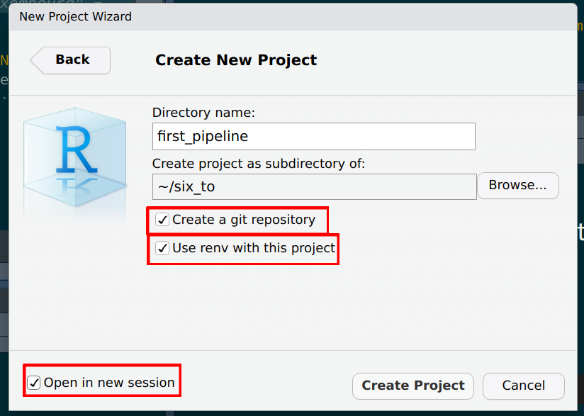
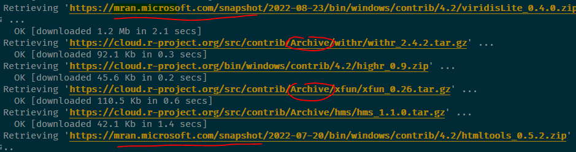

# Setting up pipelines with `{targets}`

<div style="text-align:center;">
```{r, echo = F}

```
</div>

What you’ll have learned by the end of the chapter: how to set up an (almost) reproducible pipeline.

## Introduction

`{targets}` is a build automation tool for the R programming language. *Build*, in the context of
this course means the creation of a data product. As mentioned in the introduction, this data
product can be anything from predictions from a model to interactive web applications. *Automation*
means that this build automation tool will take the burden off our shoulders when it'll be time to
run the build pipeline. Using such a tool, programmers don't need to think about which parts of the
code to rerun if they introduce a change somewhere. Only the parts affected by the change will run.
These tools also run the pipeline in parallel, because they identify independent parts of the
pipeline which are then run simultaneously. Build automation tools have many benefits, and because
they work in a certain way, they also force you to work in a more structured way.

## Build automation with R

As an introduction, there really is not a better source than the `{targets}` manual itself, and in
particular the [walkthrough section](https://books.ropensci.org/targets/walkthrough.html). After
reading this section, we have the basic knowledge to build our first pipeline. The goal of this
pipeline will be to simply create a plot using the unemployment data we've been working on. Let's
create a new project in RStudio, but make sure that you check the following boxes:

```{r, echo = F}

```

You should see the following message in the R console:

```
* Initializing project ...
* Discovering package dependencies ... Done!
* Copying packages into the cache ... Done!
The following package(s) will be updated in the lockfile:

# CRAN ===============================
- renv   [* -> 0.16.0]

The version of R recorded in the lockfile will be updated:
- R      [*] -> [4.2.1]

* Lockfile written to '~/six_to/first_pipeline/renv.lock'.
```

This is something that we have not discussed yet, so before we move on, let's have a little aside
on what `{renv}` is.

## An aside on `{renv}` 

Whether they're simple scripts to analyze some data or more complex reproducible analytical
pipelines, all of your projects depend on the packages that you use for the analysis. And these
packages evolve and change. It can very well happen that a function that you use from package
`{xyz}` version 1 won't be available anymore in version 2. Or maybe it's still available but it
works slightly differently. It can be something as trivial as the arguments of the function have been
renamed. The consequence is that when you'll try to rerun your code, it won't work at all, or
worse, it'll work, but produce a result that is not comparable to old results anymore, because the
function got changed and the underlying algorithm isn't the same anymore. So we need a certain
stability, and ideally keep reusing the same packages for the same project. If you want to update a
project to use new packages version, this can of course also be done, but it has to be conscious
choice and you will have to make sure that the updated pipeline (using the updated packages) is
able to reproduce old results before putting it into production.

It must be noted however that in my experience, it is usually possible to rerun old R code
without much hassle. But that's what makes it worse; you get so used to this stability that you
don't think about a way to keep your projects reproducible, because issues rarely happen with R.
It is thus best to get into the habit to use a tool like `{renv}`, which offers a certain stability
to your projects.

`{renv}` creates separate package libraries, one per project. The idea is quite simple; start your
project with `{renv}` enabled (if you're using RStudio, you can check the box *Use renv with this project* 
when starting a new project, if you're not using RStudio, you can run `renv::init()`, on the root of
the folder's project).
This will create a file in the root of your project called `renv.lock`. You can open this file in a
text editor, and you should see that the R version you're currently using is recorded (and the
version of `{renv}` itself). It should look something like this:

```
{
  "R": {
    "Version": "4.2.1",
    "Repositories": [
      {
        "Name": "CRAN",
        "URL": "http://cran.rstudio.com"
      }
    ]
  },
  "Packages": {
    "renv": {
      "Package": "renv",
      "Version": "0.16.0",
      "Source": "Repository",
      "Repository": "CRAN",
      "Hash": "c9e8442ab69bc21c9697ecf856c1e6c7",
      "Requirements": []
    }
  }
}
```

You can then work as usual. It doesn't matter if you're simply writing a script to perform a
"simple" analysis, or doing something more complex like a RAP. You will likely need to re-install
packages though; remember, `{renv}` sets up a library per project!

Once you're done and satisfied, run `renv::snapshot()`. As you might have guessed from the name
this will take a snapshot of the project and write the current status to the `renv.lock` file:

```
> renv::snapshot()
The following package(s) will be updated in the lockfile:

# CRAN ===============================
- R6           [* -> 2.5.1]
- cli          [* -> 3.4.1]
- dplyr        [* -> 1.0.10]
- fansi        [* -> 1.0.3]
- generics     [* -> 0.1.3]
- glue         [* -> 1.6.2]
- lifecycle    [* -> 1.0.3]
- magrittr     [* -> 2.0.3]
- pillar       [* -> 1.8.1]
- pkgconfig    [* -> 2.0.3]
- rlang        [* -> 1.0.6]
- tibble       [* -> 3.1.8]
- tidyselect   [* -> 1.2.0]
- utf8         [* -> 1.2.2]
- vctrs        [* -> 0.4.2]
- withr        [* -> 2.5.0]

Do you want to proceed? [y/N]: 
```

In it, you will see that the libraries needed to run the project are also recorded. The
`renv.lock` will now look like this:

```
{
  "R": {
    "Version": "4.2.1",
    "Repositories": [
      {
        "Name": "CRAN",
        "URL": "http://cran.rstudio.com"
      }
    ]
  },
  "Packages": {
    "R6": {
      "Package": "R6",
      "Version": "2.5.1",
      "Source": "Repository",
      "Repository": "CRAN",
      "Hash": "470851b6d5d0ac559e9d01bb352b4021",
      "Requirements": []
    },
    "cli": {
      "Package": "cli",
      "Version": "3.4.1",
      "Source": "Repository",
      "Repository": "CRAN",
      "Hash": "0d297d01734d2bcea40197bd4971a764",
      "Requirements": []
    },
    "dplyr": {
      "Package": "dplyr",
      "Version": "1.0.10",
      "Source": "Repository",
      "Repository": "CRAN",
      "Hash": "539412282059f7f0c07295723d23f987",
      "Requirements": [
        "R6",
        "generics",
        "glue",
        "lifecycle",
        "magrittr",
        "pillar",
        "rlang",
        "tibble",
        "tidyselect",
        "vctrs"
      ]
    },
    "fansi": {
      "Package": "fansi",
      "Version": "1.0.3",
      "Source": "Repository",
      "Repository": "CRAN",
      "Hash": "83a8afdbe71839506baa9f90eebad7ec",
      "Requirements": []
    },
    "generics": {
      "Package": "generics",
      "Version": "0.1.3",
      "Source": "Repository",
      "Repository": "CRAN",
      "Hash": "15e9634c0fcd294799e9b2e929ed1b86",
      "Requirements": []
    },
    "glue": {
      "Package": "glue",
      "Version": "1.6.2",
      "Source": "Repository",
      "Repository": "CRAN",
      "Hash": "4f2596dfb05dac67b9dc558e5c6fba2e",
      "Requirements": []
    },
    "lifecycle": {
      "Package": "lifecycle",
      "Version": "1.0.3",
      "Source": "Repository",
      "Repository": "CRAN",
      "Hash": "001cecbeac1cff9301bdc3775ee46a86",
      "Requirements": [
        "cli",
        "glue",
        "rlang"
      ]
    },
    "magrittr": {
      "Package": "magrittr",
      "Version": "2.0.3",
      "Source": "Repository",
      "Repository": "CRAN",
      "Hash": "7ce2733a9826b3aeb1775d56fd305472",
      "Requirements": []
    },
    "pillar": {
      "Package": "pillar",
      "Version": "1.8.1",
      "Source": "Repository",
      "Repository": "CRAN",
      "Hash": "f2316df30902c81729ae9de95ad5a608",
      "Requirements": [
        "cli",
        "fansi",
        "glue",
        "lifecycle",
        "rlang",
        "utf8",
        "vctrs"
      ]
    },
    "pkgconfig": {
      "Package": "pkgconfig",
      "Version": "2.0.3",
      "Source": "Repository",
      "Repository": "CRAN",
      "Hash": "01f28d4278f15c76cddbea05899c5d6f",
      "Requirements": []
    },
    "renv": {
      "Package": "renv",
      "Version": "0.16.0",
      "Source": "Repository",
      "Repository": "CRAN",
      "Hash": "c9e8442ab69bc21c9697ecf856c1e6c7",
      "Requirements": []
    },
    "rlang": {
      "Package": "rlang",
      "Version": "1.0.6",
      "Source": "Repository",
      "Repository": "CRAN",
      "Hash": "4ed1f8336c8d52c3e750adcdc57228a7",
      "Requirements": []
    },
    "tibble": {
      "Package": "tibble",
      "Version": "3.1.8",
      "Source": "Repository",
      "Repository": "CRAN",
      "Hash": "56b6934ef0f8c68225949a8672fe1a8f",
      "Requirements": [
        "fansi",
        "lifecycle",
        "magrittr",
        "pillar",
        "pkgconfig",
        "rlang",
        "vctrs"
      ]
    },
    "tidyselect": {
      "Package": "tidyselect",
      "Version": "1.2.0",
      "Source": "Repository",
      "Repository": "CRAN",
      "Hash": "79540e5fcd9e0435af547d885f184fd5",
      "Requirements": [
        "cli",
        "glue",
        "lifecycle",
        "rlang",
        "vctrs",
        "withr"
      ]
    },
    "utf8": {
      "Package": "utf8",
      "Version": "1.2.2",
      "Source": "Repository",
      "Repository": "CRAN",
      "Hash": "c9c462b759a5cc844ae25b5942654d13",
      "Requirements": []
    },
    "vctrs": {
      "Package": "vctrs",
      "Version": "0.4.2",
      "Source": "Repository",
      "Repository": "CRAN",
      "Hash": "0e3dfc070b2a8f0478fcdf86fb33355d",
      "Requirements": [
        "cli",
        "glue",
        "rlang"
      ]
    },
    "withr": {
      "Package": "withr",
      "Version": "2.5.0",
      "Source": "Repository",
      "Repository": "CRAN",
      "Hash": "c0e49a9760983e81e55cdd9be92e7182",
      "Requirements": []
    }
  }
}

```

On your end, you're done. You can push this project to github.com for instance, and someone
else who wishes to run this project will have to simply:

- Clone the repository;
- Run `renv::restore()` to install all the required libraries.

And that's it! This person, who might be future you, will now be able to re-run the project
with the required libraries and the right versions.

In a coming section we are actually going to do just that, but for now, let's go back to 
`{targets}`.

## Our actual first pipeline

<div style="text-align:center;">
```{r, echo = F}
knitr::include_graphics("img/mario.png")
```
</div>

Let’s start by building our very first pipeline. Our goal is the following: start with the unemployment
data for Luxembourg, and build a series of graphs. We want one graph for Luxembourg, one graph for 
cantons, and one graph for selected communes. This series of graphs will be our data product; let’s not
focus too much on the data product itself, the focus here is on building the pipeline. In the next
chapter we are going to build more interesting data products.

I’ve been mentioning pipelines for some time now, but what is it actually? Nothing more than a script.
Let’s go back to the project we started at the beginning of the chapter. We can now create a `_targets.R`
file on the root of the project. Insert the following lines in the script, we will then go through each
of them:

```{r, eval = F}
library(targets)
library(myPackage)
library(dplyr)
library(ggplot2)

list(
  tar_target(unemp_data, get_data())
)
```

The first line simply loads the `{targets}` package, the second to fourth lines load the packages
required for the pipeline to actually run. Then comes a list. Inside this list is where we will define the
targets, or the (intermediary) outputs of the pipeline. We defined `unemp_data` as being the output
of the function `get_data()`... but where does this function come from? Well, we need to create
another script called `functions.R` where we will define every function the we need for this
pipeline. Let’s create an empty script and put the following lines in it:

```{r, eval = F}
get_data <- function(){
  myPackage::unemp
}
```

This function is as simple as it gets; it doesn’t take any arguments and returns the data that we
added to our package. This function could of course just as well read data from your computer, or 
from the Internet, and return it. The fact our data is inside our package is just for convenience. 
We can now go back to `_targets.R` and first of all, add a line to source this file, and then define new targets:

```{r, eval = F}
library(targets)
library(myPackage)
library(dplyr)
library(ggplot2)
source("functions.R")

list(
  tar_target(unemp_data, get_data())
)
```

You can now run the pipeline using `tar_make()`... and you should get immediately an error:

```
> targets::tar_make()
• start target unemp_data
✖ error target unemp_data
• end pipeline [0.198 seconds]
```

This is because our package is not in the `renv.lock` file. Remember that `{renv}` creates
a new library per project, and as such we now need to install `{myPackage}` from github.com into
our project. For this, run the following line (you might need to install `{devtools}` beforehand):

```{r, eval = F}
devtools::install_github("b-rodrigues/myPackage",
                         ref = "e9d9129de3047c1ecce26d09dff429ec078d4dae")
```

The provided hash will make sure that the right version of the package gets installed for this project.
This way, if I continue to work on the package, users will be able to still install the correct version.
Since we've installed some new packages, run `renv::snapshot()` to rewrite the `renv.lock` file:

```
> renv::snapshot()
The following package(s) will be updated in the lockfile:

# CRAN ===============================
- Matrix       [* -> 1.4-1]
- backports    [* -> 1.4.1]
- base64url    [* -> 1.4]
- callr        [* -> 3.7.2]
- codetools    [* -> 0.2-18]
- data.table   [* -> 1.14.4]
- digest       [* -> 0.6.30]
- evaluate     [* -> 0.17]
- highr        [* -> 0.9]
- igraph       [* -> 1.3.5]
- knitr        [* -> 1.40]
- lattice      [* -> 0.20-45]
- processx     [* -> 3.7.0]
- ps           [* -> 1.7.1]
- stringi      [* -> 1.7.8]
- stringr      [* -> 1.4.1]
- targets      [* -> 0.13.5]
- xfun         [* -> 0.34]
- yaml         [* -> 2.3.6]

# GitHub =============================
- myPackage    [* -> b-rodrigues/myPackage@e9d9129de3047c1ecce26d09dff429ec078d4dae]

Do you want to proceed? [y/N]: 
```

It might be a good idea to take a look at the lock file, and in particular the `{myPackage}` entry.
If everything went alright, you should see something like this:

```
"myPackage": {
  "Package": "myPackage",
  "Version": "0.1.0",
  "Source": "GitHub",
  "RemoteType": "github",
  "RemoteHost": "api.github.com",
  "RemoteRepo": "myPackage",
  "RemoteUsername": "b-rodrigues",
  "RemoteRef": "e9d9129de3047c1ecce26d09dff429ec078d4dae",
  "RemoteSha": "e9d9129de3047c1ecce26d09dff429ec078d4dae",
  "Hash": "4740b43847e10e012bad2b8a1a533433",
  "Requirements": [
    "dplyr",
    "janitor",
    "rlang"
  ]
},
```

It can happen that every entry starting with "Remote" is missing. This depends how this
package was installed, and if the `DESCRIPTION` file of this package contains the required info.
If you installed it using `devtools::install_github()`, it should be fine. But it is always
better to check.
In case these are missing, you should add them by hand. Adding these fields will ensure that the
package will always get installed from github.com, and that the correct commit will be used. You
can then save the lock file and commit it alongside the rest of your project.

Ok, now we should be able to run our pipeline with `targets::tar_make()`.

This will not create any output, but this way you can at least test that it’s running. Also,
remember `tar_load()` and `tar_read()` from the walkthrough? First try to run
`tar_read(unemp_data)`, this should print the data in your console. You can then run
`tar_load(unemp_data)`, which this time loads the data in your global environment. You can now
access it interactively. This is quite useful if you need to inspect intermediary outputs.

Let’s now add intermediary outputs; we need data for Luxebmourg, data for the cantons and data for some communes. This is
where the function `clean_unemp()` from our package will come into play:

```{r, eval = F}
library(targets)
library(myPackage)
library(dplyr)
library(ggplot2)
source("functions.R")

list(
  tar_target(
    unemp_data,
    get_data()
  ),

  tar_target(
    lux_data,
    clean_unemp(unemp_data,
                place_name_of_interest = "Luxembourg",
                level_of_interest = "Country",
                col_of_interest = active_population)
  ),

  tar_target(
    canton_data,
    clean_unemp(unemp_data,
                level_of_interest = "Canton",
                col_of_interest = active_population)
  ),

  tar_target(
    commune_data,
    clean_unemp(unemp_data,
                place_name_of_interest = c("Luxembourg", "Dippach", "Wiltz", "Esch/Alzette", "Mersch"),
                col_of_interest = active_population)
  )
)


```

At this stage it might be interesting to take a look at the network. Call `tar_visnetwork()` (you might get
prompted to install yet another package) and take a look at the pipeline:

```{r, echo = F}
knitr::include_graphics("img/pipeline_2.png")
```

All that’s missing now is to write a function to create plots. Since we didn't learn how to make them using `{ggplot2}`,
simply copy the code below into the `functions.R` script:

```{r, eval = F}
make_plot <- function(data){
  ggplot(data) +
    geom_col(
      aes(
        y = active_population,
        x = year,
        fill = place_name
      )
    ) +
    theme(legend.position = "bottom",
          legend.title = element_blank())
}
```

We can now use this function to define new targets in our `_targets.R` file:

```{r, eval = F}
library(targets)
library(myPackage)
library(dplyr)
library(ggplot2)
source("functions.R")


list(
    tar_target(
        unemp_data,
        get_data()
    ),

    tar_target(
        lux_data,
        clean_unemp(unemp_data,
                    place_name_of_interest = "Luxembourg",
                    level_of_interest = "Country",
                    col_of_interest = active_population)
    ),

    tar_target(
        canton_data,
        clean_unemp(unemp_data,
                    level_of_interest = "Canton",
                    col_of_interest = active_population)
    ),

    tar_target(
        commune_data,
        clean_unemp(unemp_data,
                    place_name_of_interest = c("Luxembourg", "Dippach", "Wiltz", "Esch/Alzette", "Mersch"),
                    col_of_interest = active_population)
    ),

    tar_target(
        lux_plot,
        make_plot(lux_data)
    ),

    tar_target(
        canton_plot,
        make_plot(canton_data)
    ),

    tar_target(
        commune_plot,
        make_plot(commune_data)
    )

)

```

Let’s now take a look at the pipeline again with `tar_visnetwork()`:

```{r, echo = F}
knitr::include_graphics("img/pipeline_3.png")
```

We see that new targets are outdated, and we need to run the pipeline to build them, so run the
pipeline using `tar_make()`. If everything went well, we can now take a look at our plots using
`tar_read(luxembourg_plot)`.

Finally, let’s write these plots to disk. The way to save a `ggplot` to disk is to use the
`ggsave()` function. But targets have to return something, so
[side-effects](https://books.ropensci.org/targets/targets.html#side-effects) like writing to disk
must be handled in a specific way. What we’re going to do is write a wrapper around `ggsave()` that
will take the path where the plot should be save to disk, save the plot to the specified path, and
then return the plot. This way, we have a function that does not only have a side-effect, but also
a return value. Let’s go back to `functions.R` and add the following lines:

```{r, eval = F}
save_plot <- function(save_path, plot){
  ggsave(save_path, plot)
  save_path
}
```

We can now define these additional targets:

```{r, eval = F}
library(targets)
library(myPackage)
library(dplyr)
library(ggplot2)
source("functions.R")


list(
    tar_target(
        unemp_data,
        get_data()
    ),

    tar_target(
        lux_data,
        clean_unemp(unemp_data,
                    place_name_of_interest = "Luxembourg",
                    level_of_interest = "Country",
                    col_of_interest = active_population)
    ),

    tar_target(
        canton_data,
        clean_unemp(unemp_data,
                    level_of_interest = "Canton",
                    col_of_interest = active_population)
    ),

    tar_target(
        commune_data,
        clean_unemp(unemp_data,
                    place_name_of_interest = c("Luxembourg", "Dippach", "Wiltz", "Esch/Alzette", "Mersch"),
                    col_of_interest = active_population)
    ),

    tar_target(
        lux_plot,
        make_plot(lux_data)
    ),

    tar_target(
        canton_plot,
        make_plot(canton_data)
    ),

    tar_target(
        commune_plot,
        make_plot(commune_data)
    ),

    tar_target(
        luxembourg_saved_plot,
        save_plot("fig/luxembourg.png", lux_plot),
        format = "file"
    ),

    tar_target(
        canton_saved_plot,
        save_plot("fig/canton.png", canton_plot),
        format = "file"
    ),

    tar_target(
        commune_saved_plot,
        save_plot("fig/commune.png", commune_plot),
        format = "file"
    )


)


```

Let's take a look at the network again:

```{r, echo = F}
knitr::include_graphics("img/pipeline_4.png")
```

Because we are saving a file to disk, we must add the `format = "file"` argument to the target definiton. This way, `{targets}` watches
these files for changes as well, and reruns the pipeline if a change is detected. Run the pipeline now with `tar_make()` and watch the plots
appear in the `fig` folder (which you may have to create before running the pipeline).

Let’s now change `make_plot()` function like this:

```{r, eval = F}
make_plot <- function(data){
  ggplot(data) +
    geom_col(
      aes(
        y = active_population,
        x = year,
        fill = place_name
      )
    ) +
    theme(legend.position = "bottom",
          legend.title = element_blank()) +
    labs(title = paste0("Unemployement for ", paste(unique(data$place_name), collapse = ", ")))
}
```

If you know save the script, and check the pipeline with `tar_visnetwork()`, you will see that some targets are not out of date:


```{r, echo = F}
knitr::include_graphics("img/pipeline_5.png")
```

Every targets that gets made by `make_plot()` must be recomputed, and every targets that depends on
the intemediary outputs of `make_plot()` as well. Reloading the data is not necessary, since the
edits on `make_plot()` do not affect these targets. This is an incredible cognitive load that is
taken off the shoulders of data scientists; no need to keep track of outputs that are outdated, and
no need to re-run everything either, saving lots of time and processing power.

You now know the basics of setting up a reproducible (well, almost, as you’ll see) analytical
pipeline. Let’s now move to running someone else’s pipeline.

## Running someone else's pipeline

Let’s now suppose that we want to run someone else’s pipeline, and let’s assume that that person
did a good job and used `{renv}` to lock the dependencies of the pipeline, and also made the pipeline
available on github.com. 

As an example, we are going to use [this repository](https://github.com/wlandau/targets-minimal) from the
author of `{targets}`. To start clone this repository:

```{r, eval = F}
git clone git@github.com:wlandau/targets-minimal.git
```
and open an R session in the root of the folder (or open the `targets-minimal.rproj` file in the folder
you just cloned to open the project in RStudio), then call `renv::restore()`. 
You should see this:

```
> renv::restore()
```


```
This project has not yet been activated.
Activating this project will ensure the project library is used during restore.
Please see `?renv::activate` for more details.

Would you like to activate this project before restore? [Y/n]: 
```

Press the `y` key on your keyboard to continue. The packages to run this pipeline will get installed
in a new library, separate from the default library as usual with `{renv}`:

```
ℹ Using R 4.2.1 (lockfile was generated with R 4.1.0)
* Project '~/targets-minimal' loaded. [renv 0.16.0]
* The project library is out of sync with the lockfile.
* Use `renv::restore()` to install packages recorded in the lockfile.
The following package(s) will be updated:

# CRAN ===============================
...very long list of packages I'm not showing here...
Do you want to proceed? [y/N]: 
```

Press Y to install the packages in the separate library.

As you can see from the screenshot below, because the packages used for this pipeline
are not old(ish), they get either download from MRAN or from CRAN’s archive (MRAN is the Microsoft
R Archive Network, a mirror of CRAN maintained by Microsoft, which gets snapshotted every day. It is thus
possible to download old packages from there):

```{r, echo = F}

```

You should now restart your R session for good measure (go to `Session -> Restart Session`). You can now run
the pipeline simply with:

```{r, eval = F}
targets::tar_make()
```

The data product (or output) from this pipeline is the `index.html` file that appeared on the root folder
of your project.

## Running any code with older packages

<div style="text-align:center;">
```{r, echo = F}

```
</div>

What do you do if you need to run code with older packages, but the original developer did not use `{renv}`?
In such cases it is still possible to run that code with older packages. What you would need to know however 
is the rough date where this code was written. Let’s say that you want to run an old script from 2019, and
you want to make sure that the results you will obtain are as close, if not absolutely equal, to the results
you would have obtained then. Let’s further assume that the script was last modified on October 31st 2019.

You can rerun this script with a library that looks like one from that same date using a package made
by Microsoft, called `{checkpoint}`. This package helps install packages from their repository, MRAN 
(which was already mentioned before), and is quite easy to use. Simply add the following line at the top 
of the script:

```{r, eval = F}
checkpoint("2019-10-31")
```

You can read more about checkpoint [here](https://cran.microsoft.com/web/packages/checkpoint/vignettes/checkpoint.html).

## Why we need more

While `{renv}` is a huge step towards the right direction, there are at least four problems with it:

- `{renv}` doesn’t do anything about R itself: a pipeline made to run on R version 3 (for example) could still produce different results when run on R 4, even if the packages are the same. In practice, however, R is quite stable, and breaking changes between versions are very rare; most code is retrocompatible for many versions.
- `{renv}` doesn’t do anything about the operating system the pipeline is running on. Results can even be different between [different versions of the same operating system](https://www.frontiersin.org/articles/10.3389/fninf.2015.00012/full), but in practice, that should only affect you in very specific businesses were very high precision floating point arithmetic is required.
- `{renv}` can sometimes fail to install packages. I tried running William Landau’s demo pipeline on two computers, one running OpenSuse Linux and one running Windows 10. It ran successfully on Linux, but not on Windows.
- `{renv}` relies on MRAN and CRAN. While it is unlikely that CRAN will ever be offline, as there are many, many mirrors around the world, [and it could be argued that the longer CRAN is online, the likelier it is it’ll stay online](https://en.wikipedia.org/wiki/Lindy_effect), the same cannot (yet) be said from MRAN. However, `{renv}` could be made to rely entirely on CRAN, so this last point might not be an issue. 

We are going to solve these issues in chapter 9, but for now, let’s be grateful for `{renv}`, `{targets}` and CRAN (and MRAN), for they allow us to quite easily 
build (almost) reproducible pipelines quite easily! In the next chapter, we will continue building pipelines and build our very first data products.

## Further reading

- The `{targets}` [manual](https://books.ropensci.org/targets/)
- The `{renv}` [website](https://rstudio.github.io/renv/articles/renv.html)
