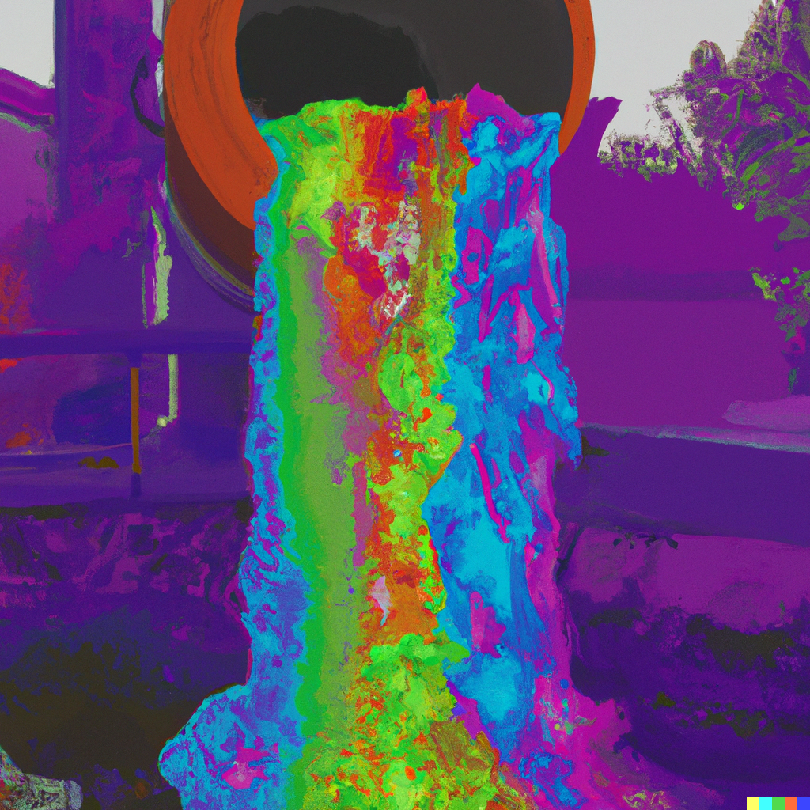

# Data products

<div style="text-align:center;">
```{r, echo = F}

```
</div>

What you’ll have learned by the end of the chapter: you'll know how to build data products using
Quarto and Shiny.

## Introduction

We are going to start by building data products using Quarto.

Quarto is a tool created by Posit, the company behind RStudio and Shiny. Quarto leverages pandoc to
convert between many document formats (for example, from `.md` to `.docx`) and makes it possible to
embed R, Python, Julia and Observable JS code into documents. It is not an R-specific tool, so it is
a program that you must install on your computer. So go to this 
[link](https://quarto.org/docs/get-started/) and download and install Quarto.

We are going to start simple, with "static" data products. By static I mean products without any
sort of interactivity, so the user can look at them, read them, but not change them in any way.
These products are essentially going to be documents in the `.docx`, `.pptx` and `.pdf` formats,
but also `.html`. Thanks to Quarto, it is thus possible to programmatically create documents.


## A first taste of Quarto

A Quarto file looks very close to a standard Markdown file. So if you know Markdown, you will not have
many problems to switch to Quarto. If you don't know Markdown, no worries, its syntax is quite simple
and can be very quickly picked up.

Let's start with a basic Quarto source. Open your favorite text editor (doesn't have to be RStudio) and
create a file called `example.qmd` and copy the following lines in it:

````{verbatim}
---
title: "My Title"
author: "My name"
date: today
---

## This is a simple quarto document
```{r}
n <- 10
rnorm(n)
```
````

[This is the output](https://tiny-melomakarona-b87385.netlify.app/).

The first few lines of the document is where you can define the title of the document, the name of the author
and the date. For the date, I've use the `today` keyword to get today's date
but you could use a string to set the date to a specific day (for example, "2022-10-28").
The content in the document consists of a level 2 title (`## This is a simple quarto document`) and of an 
R code chunk. Code chunks is were you will write code that gets then evaluated at render (compile) time.
To compile this file, run the following inside a terminal:

```
➤ quarto render example.qmd
```

If you're inside RStudio, you can also render the document by pressing `CTRL-SHIFT-K` or run the command:

```{r, eval = F}
quarto::quarto_render("example.qmd")
```

There are various ways to integrate Quarto with different editors:

- [VS Code](https://quarto.org/docs/get-started/hello/vscode.html)
- [RStudio](https://quarto.org/docs/get-started/hello/rstudio.html)
- [Jupyter](https://quarto.org/docs/get-started/hello/jupyter.html)
- [(Neo)Vim, Emacs, Sublime](https://quarto.org/docs/get-started/hello/text-editor.html#editor-modes)

Once the file is done rendering, you should find an `html` file in the same folder. 
Open this html file inside a web browser and see the output. It is possible to run arbitrary R code
inside the code chunks:


````{verbatim}
---
title: "My Title"
author: "My name"
date: today
---

## This is a simple quarto document

```{r}
library(dplyr)
library(tidyr)
library(purrr)
library(ggplot2)
library(myPackage)

data("unemp")

unemp %>% 
  janitor::clean_names() %>% 
  filter(level == "Commune",
         place_name %in% c("Luxembourg", "Esch-sur-Alzette", "Wiltz")) %>% 
  group_by(place_name) %>%
  nest() %>% 
  mutate(plots = map2(.x = data, .y = place_name, ~ggplot(data = .x) +
                                                theme_minimal() +
                                                geom_line(aes(year, unemployment_rate_in_percent, group = 1)) +
                                                labs(title = paste("Unemployment in", .y)))) %>%
  pull(plots)
```
````

[This is what the output looks like.](https://scintillating-crostata-2df896.netlify.app/)

As you can see, it is quite easy to create a document with potentially hundreds of plots using what we've learned 
until now. However, our document does not look great; for starters, we see the source code there, which we would like to hide.
People that will read this document might not be interested in the source code, but only in the plots. The other issue
is that when loading the `{dplyr}` package, users get some message informing them about some functions that get masked.
We would like to hide all of this. It turns out that code chunks have options, and we can use them to hide source code
and warning messages:


````{verbatim}
---
title: "My Title"
author: "My name"
date: today
---

## This is a simple quarto document

```{r}
#| echo: false
#| warning: false

library(dplyr)
library(tidyr)
library(purrr)
library(ggplot2)
library(myPackage)

data("unemp")

unemp %>%
  janitor::clean_names() %>%
  filter(level == "Commune",
         place_name %in% c("Luxembourg", "Esch-sur-Alzette", "Wiltz")) %>%
  group_by(place_name) %>%
  nest() %>%
  mutate(plots = map2(.x = data, .y = place_name, ~ggplot(data = .x) +
                                                theme_minimal() +
                                                geom_line(aes(year, unemployment_rate_in_percent, group = 1)) +
                                                labs(title = paste("Unemployment in", .y)))) %>%
  pull(plots)
```
````

[This is what the output looks like.](https://velvety-taffy-93cb66.netlify.app/)

Rendering this document will result in something nicer. We could also fold the code instead of completely removing
it. This is useful if we need to send the document to collaborators who might be interested in the source code as well.
However, code folding is something that only works in `html` outputs, and thus we need to specify the output format in the
header of the document (look at the three new lines after we define the data), and also remove the `echo: false` option
from the R chunk:

````{verbatim}
---
title: "My Title"
author: "My name"
date: today
format: 
  html:
    code-fold: true
---

## This is a simple quarto document

```{r}
#| warning: false

library(dplyr)
library(tidyr)
library(purrr)
library(ggplot2)
library(myPackage)

data("unemp")

unemp %>%
  janitor::clean_names() %>%
  filter(level == "Commune",
         place_name %in% c("Luxembourg", "Esch-sur-Alzette", "Wiltz")) %>%
  group_by(place_name) %>%
  nest() %>%
  mutate(plots = map2(.x = data, .y = place_name, ~ggplot(data = .x) +
                                                theme_minimal() +
                                                geom_line(aes(year, unemployment_rate_in_percent, group = 1)) +
                                                labs(title = paste("Unemployment in", .y)))) %>%
  pull(plots)
```
````

[This is what the output looks like.](https://voluble-choux-674399.netlify.app/)


It is of course possible to write several R chunks:

````{verbatim}
---
title: "My Title"
author: "My name"
date: today
format: 
  html:
    code-fold: true
---

## This is a simple quarto document

```{r}
#| warning: false

library(dplyr)
library(tidyr)
library(purrr)
library(ggplot2)
library(myPackage)

data("unemp")

unemp <- unemp %>%
  janitor::clean_names() %>%
  filter(level == "Commune")
```

There are `r length(unique(unemp$place_name))` communes in the dataset.
Below we plot the unemployment rate for 3 communes:

```{r}
unemp %>%
  filter(place_name %in% c("Luxembourg", "Esch-sur-Alzette", "Wiltz")) %>%
  group_by(place_name) %>%
  nest() %>%
  mutate(plots = map2(.x = data, .y = place_name, ~ggplot(data = .x) +
                                                theme_minimal() +
                                                geom_line(aes(year, unemployment_rate_in_percent, group = 1)) +
                                                labs(title = paste("Unemployment in", .y)))) %>%
  pull(plots)
```
````

[This is what the output looks like](https://relaxed-concha-89be95.netlify.app/).

### Python and Julia code chunks

It is possible, inside the same Quarto document, to define code chunks that run Python (or even Julia) code.
Put the following lines inside a file called `example2.qmd`
(to run the example below, you will need to have Python installed):

````{verbatim}
---
title: "R and Python"
author: "Bruno Rodrigues"
date: today
---

## This is a simple quarto document

```{r}
#| warning: false

library(dplyr)
library(tidyr)
library(purrr)
library(ggplot2)
library(myPackage)

data("unemp")

unemp <- unemp %>%
  janitor::clean_names() %>%
  filter(level == "Commune")
```


```{python}
print("hello from Python")
import sys
print(sys.version)
```

````

[This is what the output looks like.](https://phenomenal-clafoutis-2b05c1.netlify.app/)

If you have trouble rendering this line, make sure that you have the `jupyter` and `jupyterlab` modules installed.

It is also possible to pass objects from R to Python (and vice-versa):

````{verbatim}
---
title: "R and Python"
author: "Bruno Rodrigues"
date: today
---

## This is a simple quarto document

```{r}
#| warning: false

library(dplyr)
library(tidyr)
library(purrr)
library(ggplot2)
library(myPackage)

data("unemp")

unemp <- unemp %>%
  janitor::clean_names() %>%
  filter(level == "Commune")
```

The data that was loaded and cleaned from R can be accessed from Python using `r.unemp`:

```{python}
import pandas as pd
unemp_pd = pd.DataFrame(r.unemp)
unemp_pd.head
```

````

[This is what the output looks like.](https://endearing-gnome-80e9df.netlify.app/)

The HTML output is quite flexible, as it is possible to also integrate JS libraries. The following
example uses the `{g2r}` library (an R wrapper around the g2 javascript library) for creating
visualisations. To run the following code, make sure that you have the `{g2r}` package installed
(can only be install from github):

```{r, eval = F}
devtools::install_github("devOpifex/g2r")
```

The source file looks like this:

````{verbatim}
---
title: "Quarto and JS libraries"
author: "My name"
date: today
format: 
  html:
    code-fold: true
---

## This is a simple quarto document showing basic plot interactivity using {g2r}

```{r}
#| warning: false

library(dplyr)
library(tidyr)
library(purrr)
library(g2r)
library(myPackage)

data("unemp")

unemp <- unemp %>%
  janitor::clean_names() %>%
  filter(level == "Commune")
```

There are `r length(unique(unemp$place_name))` communes in the dataset. Below we plot the unemployment rate for 3 communes:

```{r}
unemp %>%
  filter(place_name %in% c("Luxembourg", "Esch-sur-Alzette", "Wiltz")) %>%
  g2(data = .) %>% 
  fig_line(asp(year, unemployment_rate_in_percent, color = place_name)) 
```

````

[This is what the output looks like.](https://timely-marzipan-6380f0.netlify.app/)

It is possible to use other JS libraries, like here `DataTables`, wrapped inside the `{DT}` package:

````{verbatim}
---
title: "Quarto and JS libraries"
author: "My name"
date: today
format: 
  html:
    toc: true
    code-fold: true
---

## Basic plot interactivity using {g2r}

```{r}
#| warning: false

library(dplyr)
library(tidyr)
library(purrr)
library(g2r)
library(DT)
library(myPackage)

data("unemp")

unemp <- unemp %>%
  mutate(year = as.character(year)) %>% 
  janitor::clean_names() %>%
  filter(level == "Commune")
```

There are `r length(unique(unemp$place_name))` communes in the dataset. Below we plot the unemployment rate for 3 communes:

```{r}
unemp %>%
  filter(place_name %in% c("Luxembourg", "Esch-sur-Alzette", "Wiltz")) %>%
  g2(data = .) %>% 
  fig_line(asp(year, unemployment_rate_in_percent, color = place_name)) 
```

## Interactive tables with {DT}

```{r}
unemp %>%
  DT::datatable(filter = "top") 
```

## Others

You can find more widgets over [here](http://gallery.htmlwidgets.org/).

````

[This is what the output looks like.](https://playful-cucurucho-5cdcbb.netlify.app/)

The final example illustrates templating. It is possible to write code that generates qmd code:

````{verbatim}
---
title: "Templating with Quarto"
author: "Bruno Rodrigues"
date: today
format: 
  html:
    toc: true
---


# Set up
The goal is to have a frequency table for each question in a survey. But we
do not want to have to do it by hand, so we define a function to create a 
table, and then, using the templating capabilities of Quarto, write some
code to generate valid qmarkdown code. In the example below our survey only
has 4 questions, but the solution described trivially scales to an infinity
of questions. This is not the case if you’re solving this problem by hand.

Start by loading the data and defining some needed variables:

```{r}
#| warning: false
library(lubridate)
library(dplyr)
library(purrr)
library(rlang)
library(DT)
survey_data <- read.csv(
"https://gist.githubusercontent.com/b-rodrigues/0c2249dec5a9c9477e0d1ad9964a1340/raw/873bcc7532b8bad613235f029884df1d0b947c90/survey_example.csv"
)


```

Let’s take a look at the data:

```{r}
datatable(survey_data)
```

The column names are actually questions, so we save those in a variable:

```{r}
questions <- colnames(survey_data)

questions
```

Now we define question codes:

```{r}
codes <- paste0("var_", seq(1, 4))

codes
```

We create a lookup table that links questions to their codes:

```{r}
lookup <- bind_cols("codes" = codes, "questions" = questions)

datatable(lookup)
```

Finally, we replace the question names in the dataset by the code:

```{r}
colnames(survey_data) <- codes

datatable(survey_data)
```

Now, we define a function that creates a frequency table. This function has
two arguments: `dataset` and `var`. It uses the `dplyr::count()` function to
count each instance of the levels of `var` in `dataset`. Then it uses the 
`knitr::kable()` function. This functions takes a data frame as an argument
and returns a table formatted in markdown code:

```{r}
create_table <- function(dataset, var){
  dataset %>%
    count(!!var) %>%
    knitr::kable()
}
```

The next function is the one that does the magic: it takes only one argument
as an input, and generates valid markdown code using the `knitr::knit_expand()`
function. Any variable between `{{}}` gets replaced by its value (so 
`{{question}}` gets replaced by the question that gets fetched from the 
lookup table defined above). Using this function, we can now loop over 
question codes, and what we get in return is valid markdown code that defines
a section with the question as the title, and our table.

```{r}
return_section <- function(var){
  a <- knitr::knit_expand(text = c("## {{question}}",   create_table(survey_data, var)),
                          question = lookup$questions[grepl(quo_name(var), lookup$codes)])
  cat(a, sep = "\n")
}
```

Our codes are strings, so to be able to use them inside of `dplyr::count()`
we need to define them as bare string, or symbols. This can be done using the
`rlang::sym()` function. If this is confusing, try running `count(mtcars, "am")` 
and you will see that it will not return what you want (compare to `count(mtcars, am)`). 
This is also why we needed `rlang::quo_name()` in the function above, to convert
the symbol back to a string, which is what `grepl()` requires:

```{r}
sym_codes <- map(codes, sym)
```

Finally, we can create the sections. The line below uses `purrr::walk()`, which
is equivalent to `purrr::map()`, the difference being that we use `purrr::walk()`
when we are interested in the side effects of a function:

```{r, results="asis"}
walk(sym_codes, return_section)
```


````


[This is what the output looks like.](https://startling-shortbread-bc36ea.netlify.app/).


## Other output formats

### Word

Let’s now generate a Word document using Quarto. As you will see, this will be quite easy; but keep in mind that the basic
interactivity that we have seen with HTML outputs won’t be possible here (but templating will work). Render the following
source file to get back a `.docx` document (you don’t even need to have MS Word installed for it to work), and 
take of what we changed from the previous file:

- Output changed from `html` to `docx`;
- No more `{DT}`, but `{pander}` instead to generated `.docx` tables

Here is the file:

````{verbatim}
---
title: "Templating with Quarto"
author: "Bruno Rodrigues"
date: today
format: docx
---


# Set up
The goal is to have a frequency table for each question in a survey. But we
do not want to have to do it by hand, so we define a function to create a 
table, and then, using the templating capabilities of Quarto, write some
code to generate valid qmarkdown code. In the example below our survey only
has 4 questions, but the solution described trivially scales to an infinity
of questions. This is not the case if you’re solving this problem by hand.

Start by loading the data and defining some needed variables:

```{r}
#| warning: false
library(lubridate)
library(dplyr)
library(purrr)
library(pander)
library(rlang)
survey_data <- read.csv(
"https://gist.githubusercontent.com/b-rodrigues/0c2249dec5a9c9477e0d1ad9964a1340/raw/873bcc7532b8bad613235f029884df1d0b947c90/survey_example.csv"
)


```

Let’s take a look at the data:

```{r}
pander(head(survey_data))
```

The column names are actually questions, so we save those in a variable:

```{r}
questions <- colnames(survey_data)

questions
```

Now we define question codes:

```{r}
codes <- paste0("var_", seq(1, 4))

codes
```

We create a lookup table that links questions to their codes:

```{r}
lookup <- bind_cols("codes" = codes, "questions" = questions)

pander(lookup)
```

Finally, we replace the question names in the dataset by the code:

```{r}
colnames(survey_data) <- codes

pander(survey_data)
```

Now, we define a function that creates a frequency table. This function has
two arguments: `dataset` and `var`. It uses the `dplyr::count()` function to
count each instance of the levels of `var` in `dataset`. Then it uses the 
`knitr::kable()` function. This functions takes a data frame as an argument
and returns a table formatted in markdown code:

```{r}
create_table <- function(dataset, var){
  dataset %>%
    count(!!var) %>%
    knitr::kable()
}
```

The next function is the one that does the magic: it takes only one argument
as an input, and generates valid markdown code using the `knitr::knit_expand()`
function. Any variable between `{{}}` gets replaced by its value (so 
`{{question}}` gets replaced by the question that gets fetched from the 
lookup table defined above). Using this function, we can now loop over 
question codes, and what we get in return is valid markdown code that defines
a section with the question as the title, and our table.

```{r}
return_section <- function(var){
  a <- knitr::knit_expand(text = c("## {{question}}",   create_table(survey_data, var)),
                          question = lookup$questions[grepl(quo_name(var), lookup$codes)])
  cat(a, sep = "\n")
}
```

Our codes are strings, so to be able to use them inside of `dplyr::count()`
we need to define them as bare string, or symbols. This can be done using the
`rlang::sym()` function. If this is confusing, try running `count(mtcars, "am")` 
and you will see that it will not return what you want (compare to `count(mtcars, am)`). 
This is also why we needed `rlang::quo_name()` in the function above, to convert
the symbol back to a string, which is what `grepl()` requires:

```{r}
sym_codes <- map(codes, sym)
```

Finally, we can create the sections. The line below uses `purrr::walk()`, which
is equivalent to `purrr::map()`, the difference being that we use `purrr::walk()`
when we are interested in the side effects of a function:

```{r, results="asis"}
walk(sym_codes, return_section)
```
````

[You can download the output here.](https://github.com/b-rodrigues/rap4mads/blob/master/img/ex10.docx?raw=true)

Unlike with HTML outputs, it is also not possible to enable code folding, but you could hide the code completely using the "#| echo = false" 
chunk option. If you wan to hide all the code without having to specify "#| echo = false" on each chunk you can also add the `execute` option
to the document header:

````{verbatim}
---
title: "Templating with Quarto"
author: "Bruno Rodrigues"
date: today
format: docx
execute:
  echo: false
---
````

You can use a document as a template for Word documents generated with Quarto. For this, you must create a new Word file, and update the
styles. This document, with the updated styles, can then be referenced in the header to act as a template:

````{verbatim}
---
title: "Using a custom Word style"
author: "Bruno Rodrigues"
date: today
format: 
  docx: 
    reference-doc: fancy_template.docx
execute:
  echo: false
---

# Introduction

## MS Word is great (lol)

This is normal text that is unreadable.

````

Just put `fancy_template.docx` in the same folder as your source qmd file. You can download the template I’ve used from 
[here](https://github.com/b-rodrigues/rap4mads/blob/master/img/fancy_template.docx?raw=true) to test things out.

For more details, visit this [page](https://quarto.org/docs/output-formats/ms-word-templates.html).

### Presentations

It is also possible to create presentations using Quarto. There are output formats as well: HTML, PDF and Powerpoint. I will
not discuss this here, because it is quite easy to get started, simply [follow along](https://quarto.org/docs/presentations/).

### PDF

I do need to discuss the PDF output a little bit. In order to generate PDF files, Quarto uses the `pdflatex` compiler (or rather
pandoc, called by Quarto, uses `pdflatex`). `pdflatex` compiles `.tex` source files to PDF, so what Quarto does (by leveraging pandoc)
is first converting a `.qmd` file to a `.tex` file, and then call `pdflatex` to compile it. `.tex` files are the file extension of the
Latex typesetting language, extensively used in science. It makes it easy to write complex mathematical formulas, like this one:

\begin{align*}
S(\omega) 
&= \frac{\alpha g^2}{\omega^5} e^{[ -0.74\bigl\{\frac{\omega U_\omega 19.5}{g}\bigr\}^{\!-4}\,]} \\
&= \frac{\alpha g^2}{\omega^5} \exp\Bigl[ -0.74\Bigl\{\frac{\omega U_\omega 19.5}{g}\Bigr\}^{\!-4}\,\Bigr] 
\end{align*}

Latex is a bit unwieldly, so using Markdown to write scientific documents is becoming more and more popular. However, Latex still 
has an edge when it comes to tables. But thankfully, it is possible to simply embed the Latex code that produces these tables in Markdown,
and there are packages that export regression table directly to PDF. In any case, in order to compile to PDF, you need to install 
Texlive. Installing Texlive is frankly a mess, but thankfully there is a very simple alternative called TinyTex. TinyTex is both
available as an R package or as a standalone installation, and was put together by the author of RMarkdown (in a sense, Quarto is
a spiritual successor to RMarkdown). This package installs a self-contained Texlive installation locally, which can then be used 
to compile PDF documents (from, or outside of R/RStudio). I highly recommend you use Tinytex. Instructions can be found
[here](https://yihui.org/tinytex/). Once you’ve installed TinyTex, you can try to compile the following example document 
(the first time you run this, it might take some time, as the required packages get installed):

````{verbatim}
---
title: "PDF example with table"
format: pdf
---

## A PDF document using Quarto

In the code below, we fit several models and then use the `{modelsummary}`
package to print a nicely formatted table with minimal effort:

```{r}
library(modelsummary)

url <- 'https://vincentarelbundock.github.io/Rdatasets/csv/HistData/Guerry.csv'
dat <- read.csv(url)

models <- list(
  "OLS 1"     = lm(Donations ~ Literacy + Clergy, data = dat),
  "Poisson 1" = glm(Donations ~ Literacy + Commerce, family = poisson, data = dat),
  "OLS 2"     = lm(Crime_pers ~ Literacy + Clergy, data = dat),
  "Poisson 2" = glm(Crime_pers ~ Literacy + Commerce, family = poisson, data = dat),
  "OLS 3"     = lm(Crime_prop ~ Literacy + Clergy, data = dat)
)

modelsummary(models)
```
And an equation, for good measure:

\begin{align*}
S(\omega) 
&= \frac{\alpha g^2}{\omega^5} e^{[ -0.74\bigl\{\frac{\omega U_\omega 19.5}{g}\bigr\}^{\!-4}\,]} \\
&= \frac{\alpha g^2}{\omega^5} \exp\Bigl[ -0.74\Bigl\{\frac{\omega U_\omega 19.5}{g}\Bigr\}^{\!-4}\,\Bigr] 
\end{align*}
````

[This is what the output looks like (scroll down to page 2).](https://github.com/b-rodrigues/rap4mads/blob/master/img/ex12.pdf?raw=TRUE).

It is possible to author, many, many, different types of documents using Quarto. For more formats, consult this 
[page](https://quarto.org/docs/gallery/). Quarto is still very new -- it was officially anounced in July of 2022 by Posit-- so
much more content will arrive. There are still many features of Quarto that we have not explored, so take your time to read
its documentation in detail.

## Interactive web applications with {shiny}

`{shiny}` is a package developed by Posit to build interactive web applications. These apps can be quite "simple" 
(for example, an app that shows a graph but in which the user can choose the variable to plot), but can be arbitrarily
complex. Some people even go as far as make [games with {shiny}](https://shiny.rstudio.com/gallery/hex-memory.html).
[A version for Python](https://shiny.rstudio.com/py/) is also in alpha, and you can already experiment with it.

In this section, I will give a very, very short introduction to `{shiny}`. This is because `{shiny}` is so feature-rich,
that I could spend 20 hours teaching you and even then we would not have seen everything. That being said, we can with
only some cursory knowledge build some useful apps. These apps can run locally on your machine, but they're really only
useful if deploy them on a server, so that users can then use these web apps on their browsers.

### The basic structure of a Shiny app

Shiny apps are always made of at least 2 parts: a *server* and a *ui*. In general, each of these parts are in separate
scripts called `server.R` and `ui.R`. It is possible to have another script, called `global.R`, where you can define
variables that you want to be available for both the server and the ui, and to every user of your app.

Let's start by building a very basic app. This app will allow users to visualize unemployment data for Luxembourg. 
For now, let's say that we want users only to be able to select communes, but not variables. The example code
below is based on this [official example](https://shiny.rstudio.com/gallery/telephones-by-region.html) 
(this is how I recommend you learn by the way. Take a look at the different example there are and adapt them 
to suit your needs! You can find the examples [here](https://shiny.rstudio.com/gallery/#demos)). 
Create a folder called something like `my_app` and then create three scripts in it:

- `global.R`
- `server.R`
- `ui.R`

Let's start with `global.R`:

```{r, eval = F}
library(myPackage)
library(dplyr)
library(ggplot2)

data("unemp")
```

In the `global.R` file, we load the required packages and data. This is now available everywhere. Let's 
continue with the `server.R` script:

```{r, eval = F}
server <- function(session, input, output) {

  filtered_data <- reactive(
    unemp %>%
    filter(place_name %in% input$place_name_selected)
  )

  output$unemp_plot <- renderPlot({

    ggplot(data = filtered_data()) +
      theme_minimal() +
      geom_line(aes(year, unemployment_rate_in_percent, color = place_name)) +
      labs(title = paste("Unemployment in", paste(input$place_name_selected, collapse = ", ")))


  })
}
```

Several things need to be commented here: first, the script contains a single function, called
`server()`. This function take three arguments, `session`, `input` and `output`. I won't go into
details here, but you should know that you will never call the `server()` function yourself, and
that these arguments are required so the function can... function. I will leave a reference at the
end of this section with more details. The next important thing is that we defined an object called
`filtered_data`. This is a reactive object. What this means is that this object should get
recomputed every time the user interacts with it. But how does the user interact with it? By
choosing the `place_name` he or she wants to see! The predicate inside `filter()` is `place_name
%in% input$place_name_selected`. Where does that `input$place_name_selected` come from? This comes
from the `ui` (that we have not written yet). But the idea is that the user will be able to chose
place names from a list, and this list will be called `place_name_selected` and will contain the
place names that the user wants to see.

Finally, we define a new object called `output$unemp_plot`. The goal of the `server()` function is
to compute things that will be part of the `output` list. This list, and the objects it contains, 
get then rendered in the `ui`. `unemp_plot` is a ggplot graph that uses the reactive data set
we defined first. Notice the `()` after `filtered_data` inside the ggplot call. These are required; 
this is how we say that the reactive object must be recomputed. If the plot does not get rendered,
the reactive data set does not get computed, since it never gets called.

Ok so now to the ui. Let's take inspiration from the same example again:

```{r, eval = F}
ui <- function(request){
  fluidPage(

    titlePanel("Unemployment in Luxembourg"),

    sidebarLayout(

      sidebarPanel(
        selectizeInput("place_name_selected", "Select place:",
                    choices=unique(unemp$place_name),
                    multiple = TRUE,
                    selected = c("Rumelange", "Dudelange"),
                    options = list(
                      plugins = list("remove_button"),
                      create = TRUE,
                      persist = FALSE # keep created choices in dropdown
                    )
                    ),
        hr(),
        helpText("Original data from STATEC")
      ),

      mainPanel(
        plotOutput("unemp_plot")
      )
    )
  )

}
```

I've added some useful things to the ui. First of all, I made it a function of an argument,
`request`. This is useful for bookmarking the state of the variable. We'll add a bookmark button
later. The ui is divided into two parts, a sidebar panel, and a main panel. The sidebar panel is
where you will typically add dropdown menus, checkboxes, radio buttons, etc, for the users to make
various selections. In the main panel, you will show the result of their selections. In the sidebar
panel I add a `selectizeInput()` to create a dynamic dropdown list using the `selectize` JS
library, included with `{shiny}`. The available choices are all the unique place names contained in
our data, I allow users to select multiple place names, by default two communes are selected and
using the `options` argument I need little "remove" buttons in the selected commune names. Finally,
in the main panel I use the `plotOutput()` function to render the plot. Notice that I use the name
of the plot defined in the server, "unemp_plot". Finally, to run this, add a new script, called 
`app.R` and add the following line in it:

```{r, eval = F}
shiny::runApp(".")
```

You can now run this script in RStudio, or from any R console, and this should open a web browser
with your app.

<div style="text-align:center;">
<video width="640" height="480" controls>
  <source src="img/shiny_1.mp4" type="video/mp4">
</video>
</div>

Believe it or not, but this app contains almost every ingredient you need to know to build shiny apps.
But of course, there are many, many other widgets that you can use to give your users even more
ways to interact with applications. 

### Slightly more advanced shiny

Let's take a look at another, more complex example. Because this second example is much more
complex, let's first take a look at a video of the app in action:

<div style="text-align:center;">
<video width="640" height="480" controls>
  <source src="img/shiny_2.mp4" type="video/mp4">
</video>
</div>


The global file will be almost the same as before:

```{r, eval = F}
library(myPackage)
library(dplyr)
library(ggplot2)
library(g2r)

data("unemp")

enableBookmarking(store = "url")

```

The only difference is that I load the `{g2r}` package to create a nice interactive plot, and enable
bookmarking of the state of the app using `enableBookmarking(store = "url")`. Let's move on to the ui:

```{r, eval = F}
ui <- function(request){
  fluidPage(

    titlePanel("Unemployment in Luxembourg"),

    sidebarLayout(

      sidebarPanel(
        selectizeInput("place_name_selected", "Select place:",
                       choices=unique(unemp$place_name),
                       multiple = TRUE,
                       selected = c("Rumelange", "Dudelange"),
                       options = list(
                         plugins = list("remove_button"),
                         create = TRUE,
                         persist = FALSE # keep created choices in dropdown
                       )
                       ),
        hr(),
        # To allow users to select the variable, we add a selectInput
        # (not selectizeInput, like above)
        # don’t forget to use input$variable_selected in the
        # server function later!
        selectInput("variable_selected", "Select variable to plot:",
                       choices = setdiff(unique(colnames(unemp)), c("year", "place_name", "level")),
                       multiple = FALSE,
                       selected = "unemployment_rate_in_percent",
                       ),
        hr(),
        # Just for illustration purposes, these radioButtons will not be bound
        # to the actionButton.
        radioButtons(inputId = "legend_position",
                     label = "Choose legend position",
                     choices = c("top", "bottom", "left", "right"),
                     selected = "right",
                     inline = TRUE),
        hr(),
        actionButton(inputId = "render_plot",
                     label = "Click here to generate plot"),
        hr(),
        helpText("Original data from STATEC"),
        hr(),
        bookmarkButton()
      ),

      mainPanel(
        # We add a tabsetPanel with two tabs. The first tab show
        # the plot made using ggplot the second tab
        # shows the plot using g2r
        tabsetPanel(
          tabPanel("ggplot version", plotOutput("unemp_plot")),
          tabPanel("g2r version", g2Output("unemp_plot_g2r"))
        )
      )
    )
  )

}
```

There are many new things. Everything is explained in the comments within the script itself so take 
a look at them. What's important to notice, is that I now added two buttons, an action button, and
a bookmark button. The action button will be used to draw the plots. This means that the user will
choose the options for the plot, and then the plot will only appear once the user clicks on the button.
This is quite useful in cases where computations take time to run, and you don't want the every reactive
object to get recomputed as soon as the user interacts with the app. This way, only once every selection
has been made can the user give the green light to the app to compute everything.

At the bottom of the ui you'll see that I've added a `tabsetPanel()` with some `tabPanel()`s. This
is where the graphs "live". Let's move on to the server script:

```{r, eval = F}
server <- function(session, input, output) {

  # Because I want the plots to only render once the user clicks the 
  # actionButton, I need to move every interactive, or reactive, element into
  # an eventReactive() function. eventReactive() waits for something to "happen"
  # in order to let the reactive variables run. If you don’t do that, then
  # when the user interacts with app, these reactive variables will run
  # which we do not want.

  # Data only gets filtered once the user clicks on the actionButton
  filtered_data <- eventReactive(input$render_plot, {
    unemp %>%
      filter(place_name %in% input$place_name_selected)
  })


  # The variable the user selects gets passed down to the plot only once the user
  # clicks on the actionButton.
  # If you don’t do this, what will happen is that the variable will then update the plot
  # even when the user does not click on the actionButton
  variable_selected <- eventReactive(input$render_plot, {
    input$variable_selected
  })

  # The plot title only gets generated once the user clicks on the actionButton
  # If you don’t do this, what will happen is that the title of the plot will get
  # updated even when the user does not click on the actionButton
  plot_title <- eventReactive(input$render_plot, {
    paste(variable_selected(), "for", paste(input$place_name_selected, collapse = ", "))
  })

  output$unemp_plot <- renderPlot({

    ggplot(data = filtered_data()) +
      theme_minimal() +
      # Because the selected variable is a string, we need to convert it to a symbol
      # using rlang::sym and evaluate it using !!. This is because the aes() function
      # expects bare variable names, and not strings.
      # Because this is something that developers have to use often in shiny apps,
      # there is a version of aes() that works with strings, called aes_string()
      # You can use both approaches interchangeably.
      #geom_line(aes(year, !!rlang::sym(variable_selected()), color = place_name)) +
      geom_line(aes_string("year", variable_selected(), color = "place_name")) +
      labs(title = plot_title()) +
      theme(legend.position = input$legend_position)


  })

  output$unemp_plot_g2r <- renderG2({

    g2(data = filtered_data()) %>%
      # g2r’s asp() requires bare variable names
      fig_line(asp(year, !!rlang::sym(variable_selected()), color = place_name)) %>%
      # For some reason, the title does not show...
      subject(plot_title()) %>%
      legend_color(position = input$legend_position)

  })
}

```

What's new here, is that I now must redefine the reactive objects in such a way that they only get
run once the user clicks the button. This is why every reactive object (but one, the position of the
legend) is now wrapped by `eventReactive()`. `eventReactive()` waits for a trigger, in this case
the clicking of the action button, to run the reactive object. `eventReactive()` takes the action button
ID as an input. I've also defined the plot title as a reactive value, not only the dataset as before,
because if I didn't do it, then the title of the plot would get updated as the user would choose
other communes, but the contents of the plot, that depend on the data, would not get updated. To avoid
the title and the plot to get desynched, I need to also wrap it around `eventReactive()`. You can see
this behaviour by changing the legend position. The legend position gets updated without the user needing
to click the button. This is because I have not wrapped the legend position inside `eventReactive()`.

Finally, I keep the `{ggplot2}` graph, but also remake it using `{g2r}`, to illustrate how it works
inside a Shiny app.

To conclude this section, we will take a look at one last app. This app will allow users to 
do data aggregation on relatively large dataset, so computations will take some time. The app
will illustrate how to best deal with this.

### Basic optimization of Shiny apps

The app we will build now requires what is sometimes referred to *medium* size data. *Medium* size
data is data that is far from being big data, but already big enough that handling it requires
some thought, especially in this scenario. What we want to do is build an app that will allow
users to do some aggregations on this data. Because the size of the data is not trivial, these
computations will take some time to run. So we need to think about certain strategies to avoid
frustrating our users. The file we will be using can be downloaded from 
[here](https://dataverse.harvard.edu/dataset.xhtml?persistentId=doi:10.7910/DVN/HG7NV7).
We're not going to use the exact same data set though, I have prepared a smaller version that
will be more than enough for our purposes. But the strategies that we are going to implement
here will also work for the original, much larger, dataset. You can get the smaller version
[here](https://mega.nz/file/l1IxHYIT#mZkeQOVpMc9XymMNtDY687sHEZHoIvDcUOm-4AwK6OI).
Uncompressed it'll be a 2.4GB file. Not big data in any sense, but big enough to be 
annoying to handle without the use of some optimization strategies.

One such strategy is only letting the computations run once the user gives the green light by clicking
on an action button. This is what we have seen in the previous example. The next obvious strategy
is to use packages that are optimized for speed. It turns out that the functions we have seen
until now, from packages like `{dplyr}` and the like, are not the fastest. Their ease of use and 
expressiveness come at a speed cost. So we will need to switch to something faster. We will do the same
to read in the data. 

This faster solution is the `{arrow}` package, which is an interface to the [Arrow software developed by Apache](https://arrow.apache.org/faq/).

The final strategy is to enable caching in the app.

So first, install the `{arrow}` package by running `install.packages("arrow")`. This will compile
`libarrow` from source on Linux and might take some time, so perhaps go grab a coffee.

Before building the app, let me perform a very simple benchmark. The script below reads in the data,
then performs some aggregations. This is done using standard `{tidyverse}` functions, but also
using `{arrow}`:

```{r, eval = F}
start_tidy <- Sys.time()
  # {vroom} is able to read in larger files than {readr}
  # I could not get this file into R using readr::read_csv
  # my RAM would get maxed out
  air <- vroom::vroom("data/combined")

  mean_dep_delay <- air |>
    dplyr::group_by(Year, Month, DayofMonth) |>
    dplyr::summarise(mean_delay = mean(DepDelay, na.rm = TRUE))
end_tidy <- Sys.time()

time_tidy <- end_tidy - start_tidy


start_arrow <- Sys.time()
  air <- arrow::open_dataset("data/combined", format = "csv")

  mean_dep_delay <- air |>
    dplyr::group_by(Year, Month, DayofMonth) |>
    dplyr::summarise(mean_delay = mean(DepDelay, na.rm = TRUE))
end_arrow <- Sys.time()

end_tidy - start_tidy
end_arrow - start_arrow
```

The "tidy" approach took 17 seconds, while the arrow approach took 6 seconds. This is an impressive
improvement, but put yourself in the shoes of a user who has to wait 6 seconds for each query. That
would get very annoying, very quickly. So the other strategy that we will use is to provide some visual 
cue that computations are running, and then we will go one step further and use caching of results 
in the Shiny app.

But before we continue, you may be confused by the code above. After all, I told you before that
functions from `{dplyr}` and the like were not the fastest, and yet, I am using them in the arrow
approach as well, and they now run almost 3 times as fast. What's going on? What's happening here,
is that the `air` object that we read using `arrow::open_dataset` is not a dataframe, but an `arrow`
dataset. These are special, and work in a different way. But that's not what's important: what's important
is that the `{dplyr}` api can be used to work with these `arrow` datasets. This means that functions
from `{dplyr}` change the way they work depending on the type of the object their dealing with.
If it's a good old regular data frame, some C++ code gets called to perform the computations. If it's 
an `arrow` dataset, `libarrow` and its black magic get called instead to perform the computations.
If you're familiar with the concept of
[polymorphism](https://en.wikipedia.org/wiki/Polymorphism_(computer_science)) this is it
(think of `+` in Python: `1+1` returns `2`, `"a"+"b"` returns `"a+b"`. A different computation
gets performed depending on the type of the function's inputs).

Let's now build a basic version of the app, only
using `{arrow}` functions for speed. This is the global file:

```{r, eval = F}
library(arrow)
library(dplyr)
library(rlang)
library(DT)

air <- arrow::open_dataset("data/combined", format = "csv")
```

The ui will be quite simple:

```{r, eval = F}
ui <- function(request){
  fluidPage(

    titlePanel("Air On Time data"),

    sidebarLayout(

      sidebarPanel(
        selectizeInput("group_by_selected", "Variables to group by:",
                       choices = c("Year", "Month", "DayofMonth", "Origin", "Dest"),
                       multiple = TRUE,
                       selected = c("Year", "Month"),
                       options = list(
                         plugins = list("remove_button"),
                         create = TRUE,
                         persist = FALSE # keep created choices in dropdown
                       )
                       ),
        hr(),
        selectizeInput("var_to_average", "Select variable to average by groups:",
                       choices = c("ArrDelay", "DepDelay", "Distance"),
                       multiple = FALSE,
                       selected = "DepDelay",
                       ),
        hr(),
        actionButton(inputId = "run_aggregation",
                     label = "Click here to run aggregation"),
        hr(),
        bookmarkButton()
      ),

      mainPanel(
        DTOutput("result")
      )
    )
  )

}

```

And finally the server:

```{r, eval = F}
server <- function(session, input, output) {

  # Numbers get crunched only when the user clicks on the action button
  grouped_data <- eventReactive(input$run_aggregation, {
    air %>%
      group_by(!!!syms(input$group_by_selected)) %>%
      summarise(result = mean(!!sym(input$var_to_average),
                              na.rm = TRUE)) %>%
      as.data.frame()
  })

  output$result <- renderDT({
    grouped_data()
  })

}
```

Because `group_by()` and `mean()` expect bare variable names, I convert them from strings to 
symbols using `rlang::syms()` and `rlang::sym()`. The difference between the two is that 
`rlang::syms()` is required when a list of strings gets passed down to the function (remember 
that the user must select several variables to group by), and this is also why `!!!` are needed
(to unquote the list of symbols). Finally, the computed data must be converted back to a 
data frame using `as.data.frame()`. This is actually when the computations happen. `{arrow}` collects
all the aggregations but does not perform anything until absolutely required. Let's see the app 
in action:

<div style="text-align:center;">
<video width="640" height="480" controls>
  <source src="img/shiny_3.mp4" type="video/mp4">
</video>
</div>

As you can see, in terms of User Experience (UX) this is quite poor. When the user clicks on the button
nothing seems to be going on for several seconds, until the table appears. Then, when the user
changes some options and clicks again on the action button, it looks like the app is crashing.

Let's add some visual cues to indicate to the user that something is happening when the button gets 
clicked. For this, we are going to use the `{shinycssloaders}` package:

```{r, eval = F}
install.packages("shinycssloaders")
```

and simply change the ui to this (and don't forget to load `{shinycssloaders}` in the global script!):

```{r, eval = F}
ui <- function(request){
  fluidPage(

    titlePanel("Air On Time data"),

    sidebarLayout(

      sidebarPanel(
        selectizeInput("group_by_selected", "Variables to group by:",
                       choices = c("Year", "Month", "DayofMonth", "Origin", "Dest"),
                       multiple = TRUE,
                       selected = c("Year", "Month"),
                       options = list(
                         plugins = list("remove_button"),
                         create = TRUE,
                         persist = FALSE # keep created choices in dropdown
                       )
                       ),
        hr(),
        selectizeInput("var_to_average", "Select variable to average by groups:",
                       choices = c("ArrDelay", "DepDelay", "Distance"),
                       multiple = FALSE,
                       selected = "DepDelay",
                       ),
        hr(),
        actionButton(inputId = "run_aggregation",
                     label = "Click here to run aggregation"),
        hr(),
        bookmarkButton()
      ),

      mainPanel(
        # We add a tabsetPanel with two tabs. The first tab show the plot made using ggplot
        # the second tab shows the plot using g2r
        DTOutput("result") |>
          withSpinner()
      )
    )
  )

}

```

The only difference with before is that now the `DTOutput()` right at the end gets passed down
to `withSpinner()`. There are several spinners that you can choose, but let's simply use the 
default one. This is how the app looks now:

<div style="text-align:center;">
<video width="640" height="480" controls>
  <source src="img/shiny_4.mp4" type="video/mp4">
</video>
</div>

Now the user gets a visual cue that something is happening. This makes waiting more bearable,
but even better than waiting with a spinner is no waiting at all. For this, we are going to enable caching
of results. There are several ways that you can cache results inside your app. You can enable
the cache on a per-user and per-session basis, or only on a per-user basis. But I think that 
in our case here, the ideal caching strategy is to keep the cache persistent, and available
across sessions. This means that each computation done by any user will get cached and available
to any other user. In order to achieve this, you simply have to install the `{cachem}` packages
add the following lines to the global script:

```{r, eval = F}
shinyOptions(cache = cachem::cache_disk("./app-cache",
                                        max_age = Inf))
```

By setting the `max_age` argument to `Inf`, the cache will never get pruned. The maximum size
of the cache, by default is 1GB. You can of course increase it.

Now, you must also edit the server file like so:

```{r, eval = F}
server <- function(session, input, output) {

  # Numbers get crunched only when the user clicks on the action button
  grouped_data <- reactive({
    air %>%
      group_by(!!!syms(input$group_by_selected)) %>%
      summarise(result = mean(!!sym(input$var_to_average),
                              na.rm = TRUE)) %>%
      as.data.frame()
  }) %>%
    bindCache(input$group_by_selected,
              input$var_to_average) %>%
    bindEvent(input$run_aggregation)

  output$result <- renderDT({
    grouped_data()
  })

}
```

We've had to change `eventReactive()` to `reactive()`, just like in the app where we don't use
an action button to run computations. Then, we pass the reactive object to `bindCache()`.
`bindCache()` also takes the `inputs`
as arguments. These are used to generate cache keys to retrieve the correct objects from cache. 
Finally, we pass all this to `bindEvent()`. This function takes the input referencing the 
action button. This is how we can now bind the computations to the button once again. Let's 
test our app now. You will notice that the first time we choose certain options, the computations
will take time, as before. But if we perform the same computations again, then the results will be shown
instantly:

<div style="text-align:center;">
<video width="640" height="480" controls>
  <source src="img/shiny_5.mp4" type="video/mp4">
</video>
</div>

As you can see, once I go back to a computation that was done in the past, the table appears
instantly. At the end of the video I open a terminal and navigate to the directory of the app,
and show you the cache. There are several `.Rds` objects, these are the final data frames that
get computed by the app. If the user wants to rerun a previous computation, the correct data frame
gets retrieved, making it look like the computation happened instantly, and with another added
benefit: as discussed above, the cache is persistent between sessions, so even if the user
closes the browser and comes back later, the cache is still there, and other users will also
benefit from the cache.

### Deploying your shiny app

The easiest way is certainly to use shinyapps.io. I won't go into details, but you can read
more about it [here](https://shiny.rstudio.com/articles/shinyapps.html). You could also
get a Virtual Private Server on a website like [Vultr](https://vultr.com) or 
[DigitalOcean](https://www.digitalocean.com/). When signing up with these services you get some
free credit to test things out. If you use my 
[Vultr referral link](https://www.vultr.com/?ref=9276120-8H) you get 100USD to test the platform. 
This is more than enough to get a basic VPS with Ubuntu on it. You can then try to install
everything needed to deploy Shiny apps from your VPS. You could follow [this
guide](https://www.marinedatascience.co/blog/2019/04/28/run-shiny-server-on-your-own-digitalocean-droplet-part-1/)
to deploy from DigitalOcean, which should generalize well to other services like Vultr. Doing this
will teach you a lot, and I would highly recommend you do it.

### References

- [The server function](https://mastering-shiny.org/basic-reactivity.html?q=input#the-server-function)
- [Using caching in Shiny to maximize performance](https://shiny.rstudio.com/articles/caching.html)
- [Engineering Production-Grade Shiny Apps](https://engineering-shiny.org/)

## How to build data products using `{targets}`

We will now put everything together and create a `{targets}` pipeline to build a data product
from start to finish. Let's go back to one of the pipelines we wrote in Chapter 7. If you're
using RStudio, start a new project and make it `renv`-enabled by checking the required checkbox.
If you're using another editor, start with an empty folder and run `renv::init()`. Now create a new
script with the following code:

```{r, eval = F}
library(targets)
library(myPackage)
library(dplyr)
library(ggplot2)
source("functions.R")

list(
    tar_target(
        unemp_data,
        get_data()
    ),

    tar_target(
        lux_data,
        clean_unemp(unemp_data,
                    place_name_of_interest = "Luxembourg",
                    level_of_interest = "Country",
                    col_of_interest = active_population)
    ),

    tar_target(
        canton_data,
        clean_unemp(unemp_data,
                    level_of_interest = "Canton",
                    col_of_interest = active_population)
    ),

    tar_target(
        commune_data,
        clean_unemp(unemp_data,
                    place_name_of_interest = c("Luxembourg", "Dippach", "Wiltz", "Esch/Alzette", "Mersch"),
                    col_of_interest = active_population)
    ),

    tar_target(
        lux_plot,
        make_plot(lux_data)
    ),

    tar_target(
        canton_plot,
        make_plot(canton_data)
    ),

    tar_target(
        commune_plot,
        make_plot(commune_data)
    )

)
```

This pipeline reads in data, then filters data and produces some plots. In another version of this
pipeline we wrote the plots to disk. Now we will add them to a Quarto document, using the
`tar_quarto()` function that can be found in the `{tarchetypes}` packages (so install it if this is
not the case yet). `{tarchetypes}` provides functions to define further types of targets, such as
`tar_quarto()` which makes it possible to render Quarto documents from a `{targets}` pipeline. But
before rendering a document, we need to write this document. This is what the document could look
like:

````{verbatim}
---
title: "Reading objects from a targets pipeline"
author: "Bruno Rodrigues"
date: today
---

This document loads three plots that were made using a `{targets}` pipeline.

```{r}
targets::tar_read(lux_plot)
```

```{r}
targets::tar_read(canton_plot)
```

```{r}
targets::tar_read(commune_plot)
```

````

Here is what the final pipeline would look like (notice that I've added `library(quarto)` to the 
list of packages getting called):

```{r, eval = F}
library(targets)
library(tarchetypes)
library(myPackage)
library(dplyr)
library(ggplot2)
library(quarto)
source("functions.R")

list(

  tar_target(
    unemp_data,
    get_data()
  ),

  tar_target(
    lux_data,
    clean_unemp(unemp_data,
                place_name_of_interest = "Luxembourg",
                level_of_interest = "Country",
                col_of_interest = active_population)
  ),

  tar_target(
    canton_data,
    clean_unemp(unemp_data,
                level_of_interest = "Canton",
                col_of_interest = active_population)
  ),

  tar_target(
    commune_data,
    clean_unemp(unemp_data,
                place_name_of_interest = c("Luxembourg", "Dippach", "Wiltz", "Esch/Alzette", "Mersch"),
                col_of_interest = active_population)
  ),

  tar_target(
    lux_plot,
    make_plot(lux_data)
  ),

  tar_target(
    canton_plot,
    make_plot(canton_data)
  ),

  tar_target(
    commune_plot,
    make_plot(commune_data)
  ),

  tar_quarto(
    my_doc,
    path = "my_doc.qmd"
  )

)

```

Make sure that this pipeline runs using `tar_make()`. If yes, and you're done with it, don't forget to run
`renv::snapshot()` to save the projects dependencies in a lock file. Again, take a look at the lock file
to make extra sure that your package is correctly being versioned. As a reminder, you should see something
like this:

```
"myPackage": {
  "Package": "myPackage",
  "Version": "0.1.0",
  "Source": "GitHub",
  "RemoteType": "github",
  "RemoteHost": "api.github.com",
  "RemoteRepo": "myPackage",
  "RemoteUsername": "b-rodrigues",
  "RemoteRef": "e9d9129de3047c1ecce26d09dff429ec078d4dae",
  "RemoteSha": "e9d9129de3047c1ecce26d09dff429ec078d4dae",
  "Hash": "4740b43847e10e012bad2b8a1a533433",
  "Requirements": [
    "dplyr",
    "janitor",
    "rlang"
  ]
},
```

What's really important is that you find the "RemoteXXXX" fields. We are now ready to push this
project to github.com. Don't forget to first edit the `.gitignore` file and add the `renv` folder
in it. This is the folder that contains the downloaded packages, and it can get quite big. It is
better to not push it. We are now done with building an almost 100% reproducible pipeline!
If your product is a Shiny app, you may want to put as much calculations as possible in the
`{targets}` pipelines. You can then use `tar_load()` or `tar_read()` inside the `global.R` file.
