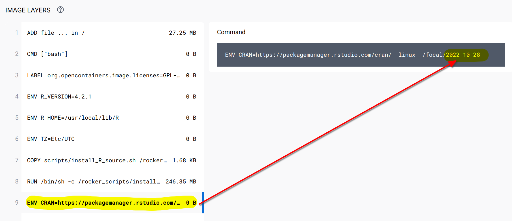
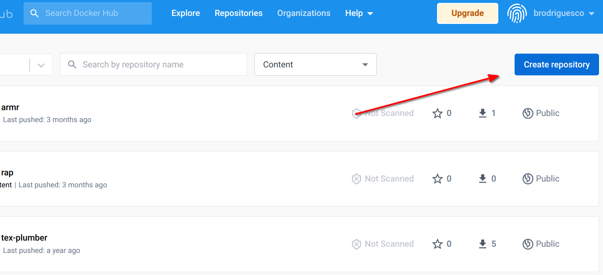

# Self-contained RAPs with Docker

<div style="text-align:center;">
```{r, echo = F}

```
</div>

What you’ll have learned by the end of the chapter: build self-contained, truly reproducible 
analytical pipelines thanks to Docker.

## Introduction

As discussed in section 7.7, while `{renv}` is a great tool that makes reproducibility quite simple, 
there are still some issues.
In order to tackle these issues, we are going to learn about Docker. Docker is used to package software
including all its dependencies, making it easy to run/deploy anywhere.
The idea is to not only deliver the source code to our data products, but also include it 
inside a complete package that contains not only R and the required libraries to rebuild the 
data product, but also many components of the underlying operating system itself, which will usually be Ubuntu...
which also means that if you're familiar with Ubuntu, you're at an advantage.

For rebuilding this data product, a single command can be used which will pull the Docker image
from Docker Hub, start a container, build the data product, and stop.

If you've never heard of Docker before, this chapter should give you the very basic knowledge required
to get started. 

Let's start by watching [this very short video](https://www.youtube.com/watch?v=-X3AeROGmOw) that 
introduces Docker.

As a reminder, let's state again what problems `{renv}` does not allow to solve. Users will need to make 
sure themselves that they're running the pipeline with the same version of R,
(as recorded in the `renv.lock` file), the same operating system, hope that `{renv}` will be able
to install the packages (which can unfortunately sometimes fail) and hope that the underlying 
infrastructure (MRAN and CRAN) are up and running. In the past, these issues were solved using 
virtual machines. The issue with virtual machines is that you cannot work with them programmatically.
In a sense, Docker can be seen a lightweight virtual machine running a Linux distribution (usually
Ubuntu) that you can interact with using the command line. This also means then that familiarity with
Linux distributions (and in particular Ubuntu) will make using Docker easily. Thankfully, there is a 
very large community of Docker users who also use R. This community is organized as the 
[Rocker Project](https://rocker-project.org/) and provides a very large collection of `Dockerfile`s 
to get easily started. As you saw in the video above, `Dockerfile`s are simple text files that
define a Docker image, from which you can start a container.

## Installing Docker

The first step is to install Docker.
You'll find the instructions for Ubuntu 
[here](https://docs.docker.com/engine/install/ubuntu/#install-using-the-repository),
for Windows [here](https://docs.docker.com/desktop/install/windows-install/) (read the
system requirements section as well!) and for macOS 
[here](https://docs.docker.com/desktop/install/mac-install/) (make sure to choose the right
version for the architecture of your Mac, if you have an M1 Mac use *Mac with Apple silicon*).

After installation, it might be a good idea to restart your computer, if the installation wizard
does not invite you to do so. To check whether Docker was installed successfully, run the following
command in a terminal (or on the desktop app on Windows): 

```
docker run --rm hello-world
```

This should print the following message:

```
Hello from Docker!
This message shows that your installation appears to be working correctly.

To generate this message, Docker took the following steps:
 1. The Docker client contacted the Docker daemon.
 2. The Docker daemon pulled the "hello-world" image from the Docker Hub.
    (amd64)
 3. The Docker daemon created a new container from that image which runs the
    executable that produces the output you are currently reading.
 4. The Docker daemon streamed that output to the Docker client, which sent it
    to your terminal.

To try something more ambitious, you can run an Ubuntu container with:
 $ docker run -it ubuntu bash

Share images, automate workflows, and more with a free Docker ID:
 https://hub.docker.com/

For more examples and ideas, visit:
 https://docs.docker.com/get-started/

```

If you see this message, congratulations, you are ready to run Docker. If you see an error message 
about permissions, this means that something went wrong. If you're running Linux, make sure that 
your user is in the Docker group by running:

```
groups $USER
```

you should see your username and a list of groups that your user belongs to. If a group called
`docker` is not listed, then you should add yourself to the group by following 
[these steps](https://docs.docker.com/engine/install/linux-postinstall/).

## The Rocker Project

The Rocker Project is instrumental for R users that want to use Docker. The project provides a large
list of images that are ready to run with a single command. As an illustration, open a terminal 
and paste the following line:

```
docker run --rm -e PASSWORD=yourpassword -p 8787:8787 rocker/rstudio
```

Once this stops running, go to `http://localhost:8787/` and enter `rstudio` as the username
and `yourpassword` as the password. You should login to a RStudio instance: this is the web
interface of RStudio that allows you to work with R from a server. In this case, the *server*
is the Docker container running the image. Yes, you've just pulled a Docker image containing 
Ubuntu with a fully working installation of RStudio web!

(If you cannot connect to `http://localhost:8787`, try with the following command:

```
docker run --rm -ti -d -e PASSWORD=yourpassword -p 8787:8787 --network="host" rocker/rstudio
```
)

Let's open a new script and run the following lines:

```{r, eval = F}
data(mtcars)

summary(mtcars)
```

You can now stop the container (by pressing `CTRL-C` in the terminal). Let's now rerun the
container... (with the same command as before) you should realize that your script is gone! This is
the first lesson: whatever you do inside a container will disappear once the container is stopped.
This also means that if you install the R packages that you need while the container is running,
you will need to reinstall them every time. Thankfully, the Rocker Project provides a list of
images with many packages already available. For example to run R with the `{tidyverse}` collection
of packages already pre-installed, run the following command:

```
docker run --rm -ti -e PASSWORD=yourpassword -p 8787:8787 rocker/tidyverse
```

If you compare it to the previous command, you see that we have replaced *rstudio* with *tidyverse*.
This is because `rocker/tidyverse` references an image, hosted on Docker Hub, that provides the 
latest version of R, RStudio server and the packages from the `{tidyverse}`. You can find the image
hosted on Docker Hub [here](https://hub.docker.com/r/rocker/tidyverse). There are many different
images, and we will be using the *versioned* images made specifically for reproducibility. For now,
however, let's stick with the `tidyverse` image, and let's learn a bit more about some specifics.

## Docker essentials

You already know about running containers using `docker run`. With the commands we ran before, your
terminal will need to stay open, or else, the container will stop. Starting now, we will run
Docker commands in the background. For this, we will use the `-d` flag (`d` as in *detach*), so 
let's stop the container one last time with `CTRL-C` and rerun it using:

```
docker run --rm -d -e PASSWORD=yourpassword -p 8787:8787 rocker/tidyverse
```

(notice `-d` just after `run`). You can run several containers in the background simultaneously.
You can list running containers with `docker ps`:

```
docker ps
CONTAINER ID   IMAGE              COMMAND   CREATED         STATUS         PORTS                                       NAMES
c956fbeeebcb   rocker/tidyverse   "/init"   3 minutes ago   Up 3 minutes   0.0.0.0:8787->8787/tcp, :::8787->8787/tcp   elastic_morse
```

The running container has the ID `c956fbeeebcb`. Also, the very last column, shows the name of the 
running container. This is a label that you can change. For now, take note of ID, because we are going
to stop the container:

```
docker stop c956fbeeebcb
```

After Docker is done stopping the running container, you can check the running containers using 
`docker ps` again, but this time no containers should get listed. Let's also discuss the other
flags `--rm`, `-e` and `-p`. `--rm` removes the container once it's stopped. Without this flag,
we can restart the container and all the data and preferences we saved will be restored. However,
this is dangerous because if the container gets removed, then everything will get lost, forever.
We are going to learn how to deal with that later. `-e` allows you to provide environment variables
to the container, so in this case the `$PASSWORD` variable. `-p` is for setting the port at which
your app is going to get served. Let's now rerun the container, but by giving it a name:

```
docker run -d --name my_r --rm -e PASSWORD=yourpassword -p 8787:8787 rocker/tidyverse
```

Notice the `--name` flag followed by the name we want to use, `my_r`. We can now interact
with this container using its name instead of its ID. For example, let's open an interactive
bash session. Run the following command:

```
docker exec -ti my_r bash
```

You are now inside a terminal session, inside the running container! This can be useful for 
debugging purposes. It's also possible to start R in the terminal, simply replace `bash`
by `R` in the command above.

Finally, let's solve the issue of our scripts disappearing. For this, create a folder somewhere on 
your computer (host). Then, rerun the container, but this time with this command:

```
docker run -d --name my_r --rm -e PASSWORD=yourpassword -p 8787:8787 -v /path/to/your/local/folder:/home/rstudio/scripts:rw rocker/tidyverse
```

where `/path/to/your/local/folder` should be replaced to the folder you created. You should now be able
to save the scripts inside the `scripts/` folder from RStudio and they will appear in the folder
you created.

## Making our own images and run some code

We now know how to save files to our computer from Docker. But as the container gets stopped 
(and removed because of --rm) if we install R packages, we would need to reinstall them each
time. The solution is thus to create our own Docker image, and as you will see, it is quite
simple to get started. Create a folder somewhere on your computer, and add a text file 
called `Dockerfile` (without any extension). In this file add, the following lines:

```
FROM rocker/tidyverse

RUN R -e "devtools::install_github('b-rodrigues/myPackage', ref = 'e9d9129de3047c1ecce26d09dff429ec078d4dae')"
```

Every `Dockerfile` starts with a `FROM` statement. This means that this `Dockerfile` will use the 
`rocker/tidyverse` image as a starting point. Then, we will simply download the package we've
been developing together using a `RUN` statement, which you've guessed it, runs a command.
Then we need to build the image. For this, run the following line:

```
docker build -t my_package .
```

This will build the image right in this folder and call it `my_package`.

```
Sending build context to Docker daemon  2.048kB
Step 1/2 : FROM rocker/tidyverse
 ---> a838ee142831
Step 2/2 : RUN R -e "devtools::install_github('b-rodrigues/myPackage', ref = 'e9d9129de3047c1ecce26d09dff429ec078d4dae')"
 ---> Using cache
 ---> 17d5d3179293
Successfully built 17d5d3179293
Successfully tagged my_package:latest
```

By running `docker images` you should see all the images that are on your PC (with running containers
or not):

```
docker images
```

```
REPOSITORY         TAG       IMAGE ID       CREATED          SIZE
my_package         latest    17d5d3179293   13 minutes ago   2.16GB
rocker/tidyverse   latest    a838ee142831   11 days ago      2.15GB
rocker/rstudio     latest    d110bab4d154   11 days ago      1.79GB
hello-world        latest    feb5d9fea6a5   13 months ago    13.3kB
```

You should see that each image takes up a lot of space: but this is misleading. Each image
that builds upon another does not duplicate the same layers. So this means that our image,
`my_package`, only add the `{myPackage}` package to the `rocker/tidyverse` image, which in
turn only adds the `{tidyverse}` packages to `rocker/rstudio`. This means unlike what
is shown here, all the images to not need 6GB of space, but only 2.16GB in total. So let's now
make sure that every other container is stopped (because we will run our container on the 
same port) and let's run our container using this command:

```
docker run --rm -d --name my_package_container -e PASSWORD=yourpassword -p 8787:8787 my_package
```

You should now see `{myPackage}` available in the list of packages in the RStudio pane.
Let's now go one step further. Let's create one plot from within Docker, and make it available to
the person running it. Let's stop again our container:

```
docker stop my_package_container
```

Now, in the same folder where your `Dockerfile` resides, add the following `R` script
(save this inside `my_graph.R`):

```
library(ggplot2)
library(myPackage)

data("unemp")

canton_data <- clean_unemp(unemp,
                           level_of_interest = "Canton",
                           col_of_interest = active_population)

my_plot <- ggplot(canton_data) +
  geom_col(
    aes(
      y = active_population,
      x = year,
      fill = place_name
    )
  ) +
  theme(legend.position = "bottom",
        legend.title = element_blank())

ggsave("/home/rstudio/scripts/my_plot.pdf", my_plot)
```

This script loads the data, and saves it to the scripts folder (as you see, this is a path inside of
the Docker image). We will also need to update the `Dockerfile`. Edit it to look like this:

```
FROM rocker/tidyverse

RUN R -e "devtools::install_github('b-rodrigues/myPackage', ref = 'e9d9129de3047c1ecce26d09dff429ec078d4dae')"

RUN mkdir /home/rstudio/graphs

COPY my_graph.R /home/rstudio/graphs/my_graph.R

CMD R -e "source('/home/rstudio/graphs/my_graph.R')"
```

We added three commands at the end; one to create a folder (using `mkdir`) another to copy our 
script to this folder (so for this, remember that you should put the R script that creates the plot
next to the `Dockerfile`) and finally an R command to source (or run) the script we've just copied.
Save the `Dockerfile` and build it again:

```
docker build -t my_package .
```

Let's now run our container with the following command (notice that we do not use `-p` nor the `-e`
flags anymore, because we're not interested in running RStudio in the browser anymore):

```
docker run --rm --name my_package_container -v /path/to/your/local/folder:/home/rstudio/scripts:rw my_package
```

After some seconds, you should see a PDF in the folder that you set up. This is the output of the 
script! You probably see now where this is going: we are going to define a `{targets}` pipeline
that will be run each time the container is run. But one problem remains.

## Reproducibility with Docker

Our `Dockerfile`, as it is now, is not suited for reproducibility. This is because each time the image
gets built, the latest version of R and package will get pulled from the Internet. We need to use
a `Dockerfile` that builds exactly the same image, regardless of when it gets built.
Thankfully, the Rocker Project is here to help. A series of `Dockerfiles` are available that:

- always use the exact same version of R;
- a frozen CRAN repository will be used to pull the packages;
- a long term support of Ubuntu is used as a base image.

You can read about it more [here](https://github.com/rocker-org/rocker-versioned2/wiki/Versions). As
I'm writing this, the latest stable image uses R v4.2.1 on Ubuntu 20.04. The latest image,
based on Ubuntu 22.04 and which uses the latest version of R (v4.2.2) still uses the default CRAN
repository, not a frozen one. So for our purposes, we will be using the `rocker/r-ver:4.2.1` image,
which you can find [here](https://hub.docker.com/layers/rocker/r-ver/4.2.1/images/sha256-3636493af7028d899a6598ee4aabe70d231fb0ff60f61a70f8ea0ea24a51c3e6?context=explore). What's quite important,
is to check that the CRAN mirror is frozen. Look for the line in the `Dockerfile` that starts
with `ENV CRAN...` and you should see this:


<div style="text-align:center;">
```{r, echo = F}

```
</div>


As you can see in the screenshot, we see that the CRAN mirror is set to the 28 of October 2022.
Let's now edit our `Dockerfile` like so:

```
FROM rocker/r-ver:4.2.1

RUN R -e "install.packages(c('devtools', 'ggplot2'))"

RUN R -e "devtools::install_github('b-rodrigues/myPackage', ref = 'e9d9129de3047c1ecce26d09dff429ec078d4dae')"

RUN mkdir /home/graphs

COPY my_graph.R /home/graphs/my_graph.R

CMD R -e "source('/home/graphs/my_graph.R')"
```

As you can see, we've changed to first line to `rocker/r-ver:4.2.1`, added a line to install the 
required packages, and we've removed `rstudio` from the paths in the other commands. This is because
`r-ver` does not launch an RStudio session in browser, so there's no `rstudio` user. Before
building the image, you should also update the script that creates the plot. This is because in the
last line of our script, we save the plot to `"/home/rstudio/scripts/my_plot.pdf"`, but remember, there's
no `rstudio` user. So remove this from the `ggsave()` function. Also, add another line to the script,
right at the bottom:

```
writeLines(capture.output(sessionInfo()), "/home/scripts/sessionInfo.txt")
```

so the script finally looks like this:

```
library(ggplot2)
library(myPackage)

data("unemp")

canton_data <- clean_unemp(unemp,
                           level_of_interest = "Canton",
                           col_of_interest = active_population)

my_plot <- ggplot(canton_data) +
  geom_col(
    aes(
      y = active_population,
      x = year,
      fill = place_name
    )
  ) +
  theme(legend.position = "bottom",
        legend.title = element_blank())

ggsave("/home/scripts/my_plot.pdf", my_plot)

writeLines(capture.output(sessionInfo()), "/home/scripts/sessionInfo.txt")
```

Now, build this image using:

```
docker build -t my_package .
```

and this will run R and install the packages. This should take some time, because `r-ver` images do not
come with any packages preinstalled. Once this is done, we can run a container from this image using:

```
docker run --rm --name my_package_container -v /path/to/your/local/folder:/home/scripts:rw my_package
```

You should see two files now: the plot, and a `sessionInfo.txt` file. Open this file, and you should see
the following:

```
R version 4.2.1 (2022-06-23)
Platform: x86_64-pc-linux-gnu (64-bit)
Running under: Ubuntu 20.04.5 LTS
```

This confirms that the code ran indeed on R 4.2.1 under Ubuntu 20.04.5 LTS. You should also
see that the `{ggplot2}` version used is `{ggplot2}` version 3.3.6, which is older than the 
version you could get now (as of November 2022), which is 3.4.0.

We now have all the ingredients and basic knowledge to build a fully reproducible pipeline.

## Building a truly reproducible pipeline

Ok so we are almost there; we now know how to run code in an environment that is completely
stable, so our results are 100% reproducible. However, there are still some things that
we can learn in order to make our pipeline even better. First of all, we can make it run 
faster by creating an image that has already all the packages that we need installed.
This way, whenever we will need to build it, no packages will need to be installed. We will 
also put this image on Docker Hub, so in the future, people that want to run our pipeline
can do so by pulling the pre-built image from Docker, instead of having to rebuild it 
using the `Dockerfile`. In order to get an image on Docker Hub, you first need to create
an account [there](https://hub.docker.com/). Once logged in, you can click on 
`Create repository`:

<div style="text-align:center;">
```{r, echo = F}

```
</div>

You can then give a name to this repository. Let's now create an image that we will push.
Let's restart from the `Dockerfile` that we used, and add a bunch of stuff:

```
FROM rocker/r-ver:4.2.1

RUN apt-get update && apt-get install -y \
    libglpk-dev \
    libxml2-dev \
    libcairo2-dev \
    libgit2-dev \
    default-libmysqlclient-dev \
    libpq-dev \
    libsasl2-dev \
    libsqlite3-dev \
    libssh2-1-dev \
    libxtst6 \
    libcurl4-openssl-dev \
    libharfbuzz-dev \
    libfribidi-dev \
    libfreetype6-dev \
    libpng-dev \
    libtiff5-dev \
    libjpeg-dev \
    unixodbc-dev \
    wget

RUN wget https://github.com/quarto-dev/quarto-cli/releases/download/v1.2.269/quarto-1.2.269-linux-amd64.deb -O /home/quarto.deb
RUN apt-get install --yes /home/quarto.deb
RUN rm /home/quarto.deb

RUN R -e "install.packages(c('devtools', 'tidyverse', 'janitor', \
   'shiny', 'targets', 'tarchetypes', \
   'quarto', 'shiny', 'testthat', \
   'usethis', 'rio'))"

RUN R -e "devtools::install_github('b-rodrigues/myPackage', ref = 'e9d9129de3047c1ecce26d09dff429ec078d4dae')"

CMD ["R"]
```

This `Dockerfile` starts off with `r-ver:4.2.1` and adds the dependencies that we will need for our
pipelines. Then, I install development libraries, these are required to run the R packages (maybe
not all of them though). I found the list
[here](https://github.com/rocker-org/rocker-versioned2/blob/master/scripts/install_tidyverse.sh);
this is a script that gets used by some of the `Dockerfile`s provided by the Rocker Project. I only
copied the parts I needed. Then I download the Quarto installer for Ubuntu, and install it. Finally
I install the packages for R, as well as the package we've developed together. This `Dockerfile`
should not look too intimidating IF you're familiar with Ubuntu. If not... well this is why I said
in the intro that familiarity with Ubuntu would be helpful. Now you probably see why Rocker is so
useful; if you start from an `rstudio` image all of these dependencies come already installed. But
because we're using an image made specifically for reproducibility, *only* the frozen repos were
set up, which is why I had to add all of this manually. But no worries, you can now use this
`Dockerfile` as a reference.

Anyways, we can now build this image using:

```
docker build -t r421_rap .
```

And now we need to wait for the process to be done. Once it's finished, we can run it using:

```
docker run --rm -ti --name r421_rap_container r421_rap 
```

(notice the `-ti` argument here; this is needed because we want to have an interactive session with
R opened, if you omit this flag, R will get launched, but then immediately close). We can test it
by loading some packages and see that everything is alright.

Let's now get this image on Dockerhub; this way, we can pull it instead of having to build it in
the future. First logging to Docker Hub from the terminal:

```
docker login 
```

You should then enter your username and password. We are now ready to push, so check the image id
using `docker images`:

```
docker images
REPOSITORY         TAG       IMAGE ID       CREATED          SIZE
r421_rap           latest    864350bf1143   5 minutes ago    1.98GB
```

Tag the image, in this case the tag I've used is `version1`:

```
docker tag 864350bf1143 your_username_on_docker_hub/r421_rap:version1
```

And now I can push it, so that everyone can use it:

```
docker push brodriguesco/r421_rap:version1
```

We can now use this as a base for our pipelines! Let's now create a new `Dockerfile` that will use
this image as a base and run the plot from before:

```
FROM brodriguesco/r421_rap:version1

RUN mkdir /home/graphs

COPY my_graph.R /home/graphs/my_graph.R

CMD R -e "source('/home/graphs/my_graph.R')"
```

save this `Dockerfile` in a new folder, and don't forget to add the `my_graph.R` script with it.
You can now build the image using:

```
docker build -t my_pipeline .
```

You should see this:

```
Sending build context to Docker daemon  3.584kB
Step 1/4 : FROM brodriguesco/r421_rap:version1
version1: Pulling from brodriguesco/r421_rap
eaead16dc43b: Pull complete 
```

As you can see, now Docker is pulling the image I've uploaded... and what's great is that this
image already contains the correct versions of the required packages and R.

Before continuing now, let's make something very clear: the image that I made available on
Docker Hub is prebuilt, which means that anyone building a project on top of it, will not
have to rebuild it. This means also, that in theory, there would be no need to create an image
built on top of an image like `rocker/r-ver:4.2.1` with frozen repositories. Because most
users of the `brodriguesco/r421_rap` image would have no need to rebuild it. However, in cases
where users would need to rebuild it, it is best practice to use such a stable image as 
`rocker/r-ver:4.2.1`. This makes sure that if the image gets rebuilt in the future, then 
it still pulls the exact same R and packages versions as today.

Ok, so now to run the pipeline this line will do the job:

```
docker run --rm --name my_pipeline_container -v /home/cbrunos/docker_folder:/home/scripts:rw my_pipeline
```

So basically, all you need for your project to be reproducible is a Github repo, where you
make the `Dockerfile` available, as well as the required scripts, and give some basic instructions
in a `Readme`.

To conclude this section, take a look at 
[this repository](https://github.com/b-rodrigues/dockerized_pipeline_demo/tree/main).
This repository defines in three files a pipeline that uses Docker for reproducibility:

- A `Dockerfile`;
- `_targets.R` defining a `{targets}` pipeline;
- `functions.R` which includes needed functions for the pipeline.

Try to run the pipeline, and study the different files. You should recognize the commands used
in the `Dockerfile`. 

Now it's your turn to build reproducible pipelines!

## One last thing

It should be noted that you can also use `{renv}` in combination with Docker. What you could do is
copy an `{renv}` lockfile into Docker, and restore the packages with `{renv}`. You could then
push this image, which would contain every package, to Docker Hub, and then provide this image
to your future users instead. This way, you wouldn’t need to use a base image with frozen CRAN
repos as we did. That’s up to you.

## Further reading

- https://www.statworx.com/content-hub/blog/wie-du-ein-r-skript-in-docker-ausfuehrst/ (in German, English translation: https://www.r-bloggers.com/2019/02/running-your-r-script-in-docker/)
- https://colinfay.me/docker-r-reproducibility/
- https://jsta.github.io/r-docker-tutorial/
- http://haines-lab.com/post/2022-01-23-automating-computational-reproducibility-with-r-using-renv-docker-and-github-actions/
