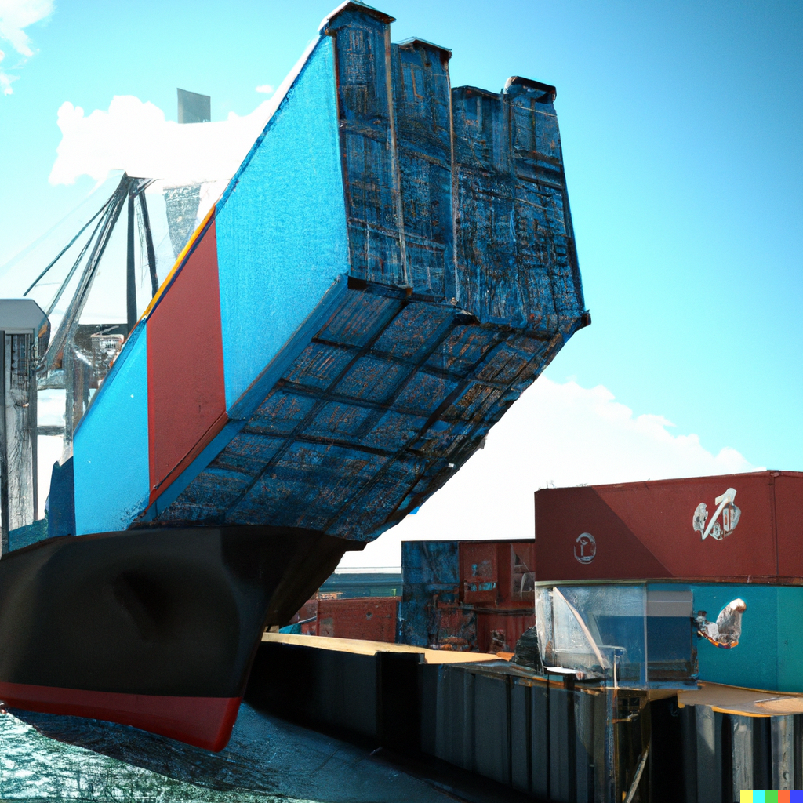

# Self-contained RAPs with Docker

<div style="text-align:center;">
```{r, echo = F}

```
</div>

This link should be discussed

https://rocker-project.org/use/reproducibility.html

and this link then as well

https://github.com/rocker-org/rocker-versioned2/wiki/Versions


## References

https://www.statworx.com/content-hub/blog/wie-du-ein-r-skript-in-docker-ausfuehrst/ (in German, English translation: https://www.r-bloggers.com/2019/02/running-your-r-script-in-docker/)
